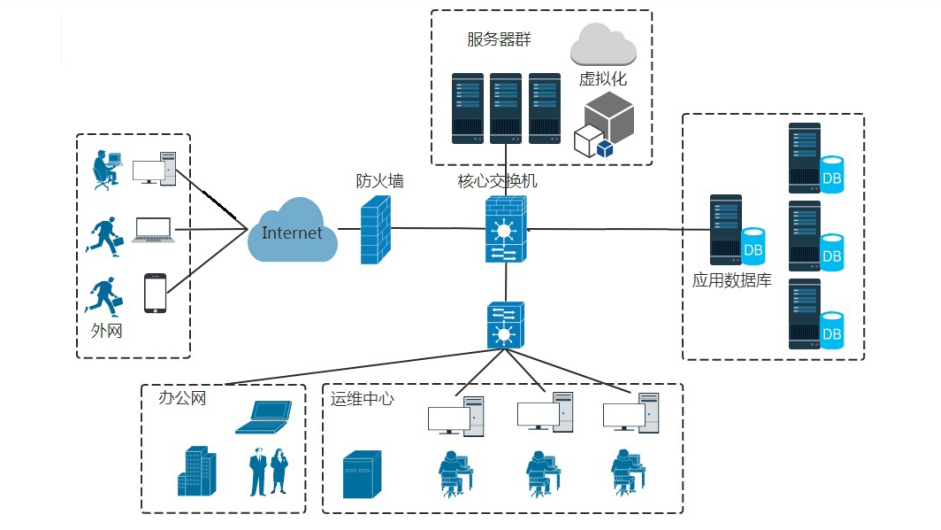
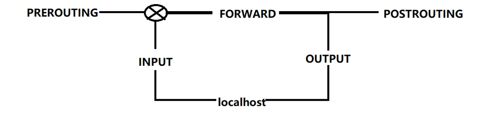
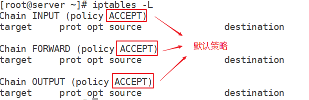
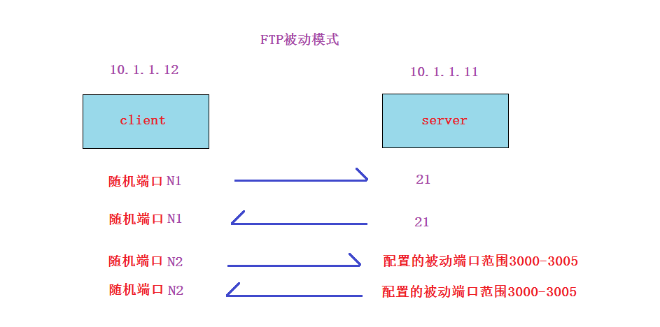
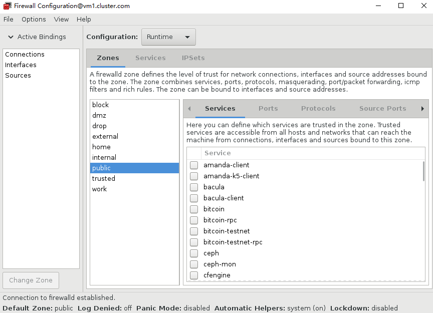

# 任务背景

​       我们需要对整个内网机房服务器与外网的流量进行控制与实现安全策略，这时候就可以用到防火墙了。


**学习目标**

- [ ] 了解防火墙的作用与分类

- [ ] 了解iptables的4表5链结构和基本语法

- [ ] 能够使用iptables实现服务的包过滤控制

- [ ] 能够使用firewalld实现服务的包过滤控制


# 认识防火墙

## 防火墙作用

防火墙作为一种访问控制设备， 常常安装在内部网络和外部网络的边际上。主要用于保护内部网络的信息安全。


## 防火墙分类

逻辑上划分，防火墙可以大体分为主机防火墙和网络防火墙

* 主机防火墙：针对于单个主机进行防护

* 网络防火墙：针对网络进行防护，处于网络边缘，防火墙背后是本地局域网

  网络防火墙主外(服务集体)，主机防火墙主内(服务个人)


物理上划分，防火墙可分为硬件防火墙和软件防火墙

* 硬件防火墙：在硬件级别实现防火墙功能，另一部分基于软件实现，其性能高，硬件成本高
* 软件防火墙：应用软件处理逻辑运行于通用硬件平台之上的防火墙，其性能相较于硬件防火墙低，成本较低




**硬件防火墙图示**


**软件防火墙图示**


**Web应用防火墙**

Web应用防火墙是对web防护(网页保护)的安全防护设备(软件)，主要用于截获所有HTTP数据或仅仅满足某些规则的会话，多见于云平台中。


# iptables

官网: https://www.netfilter.org/

iptables全称为netfilter/iptables, 是linux平台下自带的的开源包过滤防火墙。


## iptables的应用

* 包过滤(重点)
* NAT(重点)
* 协助实现策略路由和流量控制(拓展)
* 包标记(拓展)


## iptables结构

**四张表**

* filter:  实现对数据包的过滤
* nat: 主要修改数据包的地址和端口，例如源地址或目标地址
* mangle：对数据包进行修改，例如给数据包打标记MARK
* raw：主要做连接追踪

**五条链**

* INPUT

* OUTPUT

* FORWARD

* PREROUTING

* POSTROUTING





## Iptables基本语法

常见语法格式:


```powershell
	-A   增加一条规则，后接链名，默认是加到规则的最后面
	-D   删除
	-L   列出规则 
	-n   以数值显示 
	-I   在最前面插入规则 
	-v   显示统计数据，与－L一起用，看到的信息更多

	-F   清空规则
	-z   清空计数器
	-x   清空自定义链

	-t   后接表名
	-P   policy，默认策略
	-p   protocol,后接协议名
	--dport	 目标端口
	--sport  源端口
	-d  destination,目标地址
	-s  source,源地址	
	-i  接网卡接口， 进入的网卡接口
	-o  接网卡接口， 出去的网卡接口
	-j  后接动作

	动作的分类：

	ACCEPT    	接收数据包
	DROP	    丢弃数据包
	REJECT   	拒绝数据包，和DROP的区别就是REJECT会返回错误信息，DROP不会
	MASQUEREAD  IP地址伪装，使用NAT转换成外网IP，可以PPP拔号（外网IP不固定情况）
	SNAT   		源地址转换，它与MASQUEREAD的区别是SNAT是接一个固定IP
	DNAT		目标地址转换
	LOG    		记录日志
```

# filter表包过滤

先安装iptables相关软件包，并启动服务

```powershell
# yum install iptables-services -y

# systemctl start iptables.service
# systemctl enable iptables.service
```

小结:  只要有iptables命令就可以写规则，但是在centos7上软件包不安装完全，是没有iptables服务的(主要安装**iptables-services**软件包)。


## **查看规则**

**==注意: 不指定表，默认为filter表==**

~~~powershell
# iptables  -L
# iptables  -L -t filter

# iptables -L -t  nat
# iptables -L -t  mangle
# iptables -L -t  raw
~~~

这三张表可能有默认的规则，我们先把规则都清掉

~~~powershell
# iptables -t filter -F
# iptables -t nat -F
# iptables -t mangle -F
~~~


## 控制ping

首先,要知道的是ping是icmp (internet control message protocol)协议,此协议没有端口


在server上拒绝10.1.1.0/24网段ping通自己(以下四条都可以实现,为什么?)

~~~powershell
# iptables -t filter -A INPUT -p icmp -s 10.1.1.0/24 -j REJECT
# iptables -t filter -D INPUT -p icmp -s 10.1.1.0/24 -j REJECT			删除上一条规则
~~~

~~~powershell
# iptables -t filter -A INPUT -p icmp -s 10.1.1.0/24 -j DROP
# iptables -t filter -D INPUT -p icmp -s 10.1.1.0/24 -j DROP			删除上一条规则
~~~

~~~powershell
# iptables -t filter -A OUTPUT -p icmp -d 10.1.1.0/24 -j REJECT
# iptables -t filter -D OUTPUT -p icmp -d 10.1.1.0/24 -j REJECT			删除上一条规则
~~~

~~~powershell
# iptables -t filter -A OUTPUT -p icmp -d 10.1.1.0/24 -j DROP
# iptables -t filter -D OUTPUT -p icmp -d 10.1.1.0/24 -j DROP			删除上一条规则
~~~

如果不写-s或-d, 默认代表所有人

~~~powershell
# iptables -t filter -A INPUT -p icmp  -j REJECT
~~~

也可以使用iprange语法使用多IP匹配

~~~powershell
# iptables -A INPUT -p icmp -m iprange --src-range 10.1.1.10-10.1.1.20 -j REJECT
~~~


## 匹配规则的顺序

**问题:** 我想实现所有人都ping不通我，但是10.1.1.12这个IP能ping通我

**iptables匹配规则的顺序**: **==每条链里的规则读取顺序是从上往下一条一条匹配，匹配一条就不继续往下匹配，都没有匹配，则最后匹配默认策略==**




~~~powershell
# iptables -t filter -A INPUT -p icmp -j REJECT
# iptables -t filter -A INPUT -p icmp -s 10.1.1.12 -j ACCEPT
此写法错误的，因为-A是在下面增加规则，按匹配规则来看，无法允许10.1.1.12
~~~

~~~powershell
# iptables -t filter -A INPUT -p icmp -j REJECT
# iptables -t filter -I INPUT -p icmp -s 10.1.1.12 -j ACCEPT
正确写法，把第二条加到第一条前面.-I表示规则插入到最上面
~~~

~~~powershell
# iptables -t filter -I INPUT 2 -p icmp -s 10.1.1.13 -j ACCEPT
链后面接数字2，表示插入到原来第二条的上面，成为新的第2条
~~~


## 规则的删除与清空

方法一:

~~~powershell
# iptables -t filter -D  INPUT -s 10.1.1.12  -p icmp -j ACCEPT
加的时候怎么写，删除时就要怎么写  A参数换成D参数就可以
~~~

方法二:

~~~powershell
# iptables -L -n --line			
# iptables  -D INPUT 2
在规则比较多或者不好写规则的情况下，可以先用--line或者--line-number列出行号，再用行号删除
~~~

方法三:

~~~powershell
# iptables -F   
直接清空filter表的所有规则
~~~


## 规则的修改

~~~powershell
# iptables -t filter -R INPUT 3 -p icmp -s 10.1.1.8 -j ACCEPT
把filter表INPUT链第3行进行修改
~~~


## 规则的保存与还原

~~~powershell
# iptables-save > /etc/sysconfig/iptables
将当前规则保存到这个文件，文件可以自定义
~~~

~~~powershell
# iptables-restore < /etc/sysconfig/iptables
把保存的规则还原回去
~~~

**注意:** /etc/sysconfig/iptables文件为默认保存文件。重启iptables服务会默认把此文件里的规则还原。当然也可以手工保存到另一个文件，就需要iptables-restore手动还原了。

技巧一:

如果想要永久保留规则, 则先`iptables-save > /etc/sysconfig/iptables`保存,再`systemctl enable iptables.service`做成开机自动启动就可以了

技巧二:

如果你想做成开机自动空规则（没有任何iptables策略)，你可以把/etc/sysconfig/iptables保存为空规则，然后`systemctl enable iptables.service　`


## 链默认策略的修改

~~~powershell
filter表的INPUT键默认策略改为DROP
# iptables -P INPUT DROP
filter表的OUTPUT键默认策略改为DROP
# iptables -P OUTPUT DROP

# iptables -L -n
~~~

~~~powershell
filter表的INPUT键默认策略改为ACCEPT
# iptables -P INPUT ACCEPT
filter表的OUTPUT键默认策略改为ACCEPT
# iptables -P OUTPUT ACCEPT

# iptables -L -n
~~~


## 控制httpd


**防火墙比较通用的访问过程**


在server端的准备工作

~~~powershell
# yum install httpd httpd-devel -y
# echo "server主页" > /var/www/html/index.html
# systemctl restart httpd
# systemctl enable httpd
~~~

**场景**: client端没有任何防火墙规则, server端只允许10.1.1.12访问httpd, 其它任何访问都拒绝

~~~powershell
# iptables -F
# iptables -P INPUT DROP
# iptables -P OUTPUT DROP
# iptables -A INPUT -p tcp --dport 80 -s 10.1.1.12 -j ACCEPT
# iptables -A OUTPUT -p tcp --sport 80 -d 10.1.1.12 -j ACCEPT
~~~


**拓展场景**: 在前面场景的基础上加上客户端防火墙规则

~~~powershell
# iptables -F
# iptables -P INPUT DROP
# iptables -P OUTPUT DROP
# iptables -A OUTPUT -p tcp --dport 80 -d 10.1.1.11 -j ACCEPT
# iptables -A INPUT -p tcp --sport 80 -s 10.1.1.11 -j ACCEPT
~~~

**拓展:** 加入下面两句就可以实现本地访问

~~~powershell
# iptables -A INPUT -i lo  -j ACCEPT
# iptables -A OUTPUT -o lo  -j ACCEPT
~~~

问题: 把httpd服务换成sshd服务, 如何实现?

~~~powershell
tcp 22
~~~

问题: 把httpd服务换成dns服务，如何实现?

~~~powershell
udp 53    客户端查询服务器
tcp 53    主从DNS服务器同步数据
~~~

问题: 把httpd服务换成mysql服务，如何实现?

~~~powershell
tcp 3306
~~~


## 控制多端口服务

连续端口和多端口写法

```powershell
# iptables -A INPUT -p tcp --dport 1:1000 -j ACCEPT
# iptables -A INPUT -p tcp -m multiport  --dport 22,80 -j ACCEPT
```


**场景**: client端没有任何防火墙规则, server端只允许被访问samba, 其它任何访问都拒绝

~~~powershell
# iptables -P INPUT DROP
# iptables -P OUTPUT DROP

# iptables -A INPUT -p tcp -m multiport --dport 139,445  -j ACCEPT
# iptables -A OUTPUT -p tcp -m multiport --sport 139,445  -j ACCEPT
~~~

问题: 把httpd服务换成rsync服务, 如何实现?

873和22


**练习:** 将前面server上的22与80写成多端口的写法,然后将client的防火墙都去掉

(后面例子都只讨论server端规则写法，不再讨论client端了)

client去掉规则

~~~powershell
# iptables -F
# iptables -P INPUT ACCEPT
# iptables -P OUTPUT ACCEPT
~~~

server端写法

~~~powershell
# iptables -F
# iptables -A INPUT -p tcp -m multiport --dport 22,80 -j ACCEPT
# iptables -A OUTPUT -p tcp -m multiport --sport 22,80 -j ACCEPT
~~~


## 控制ftp(难点)


**场景:** vsftp实现双链拒绝的情况下，客户端通过主动和被动都能访问进来

在server端的准备

~~~powershell
server# yum install vsftpd -y

直接在配置文件最后加上这两句就可以
server# vim /etc/vsftpd/vsftpd.conf
pasv_min_port=3000
pasv_max_port=3005

server# systemctl restart vsftpd

server# iptables -P INPUT DROP
server# iptables -P OUTPUT DROP
~~~

客户端测试方法:

* 命令连接测试

~~~powershell
下面能成功连接上就表示命令端口连接没问题
client# yum install ftp -y
client# ftp 10.1.1.11(服务器的ip)
~~~

* 数据传输测试

~~~powershell
登录成功后，在客户端使用passive指令转换你的主动和被动模式(服务器端不用转换，因为服务器端默认就是主动和被动都支持的)
然后使用ls指令能看到里面的pub子目录就表示数据传输OK了（因为默认是登录到服务器的/var/ftp/目录，里面有一个pub子目录)
~~~


~~~powershell
# iptables -A INPUT -p tcp --dport 21 -j ACCEPT
# iptables -A OUTPUT -p tcp --sport 21 -j ACCEPT
# iptables -A OUTPUT -p tcp --sport 20 -j ACCEPT
# iptables -A INPUT -p tcp --dport 20 -j ACCEPT
~~~



~~~powershell
# iptables -A INPUT -p tcp --dport 21 -j ACCEPT
# iptables -A OUTPUT -p tcp --sport 21 -j ACCEPT
# iptables -A INPUT -p tcp --dport 3000:3005 -j ACCEPT
# iptables -A OUTPUT -p tcp --sport 3000:3005 -j ACCEPT
~~~

将上面写的合到一起，就只有以下两条规则了

~~~powershell
# iptables -A INPUT -p tcp -m multiport --dport 20,21,3000:3005 -j ACCEPT
# iptables -A OUTPUT -p tcp -m multiport --sport 20,21,3000:3005 -j ACCEPT
~~~


**注意:** 我笔记里都是使用双链拒绝，工作中很多情况单链就够了。


## state控制(拓展)

什么是state(状态控制)？

答: 通俗的说就是通过连接状态进行防火墙控制的一个包过滤条件。如果按照tcp/ip来划分连接状态，有11种之多

但iptables里主要是4种状态

| 状态        | 说明                                                         |
| ----------- | ------------------------------------------------------------ |
| NEW         | NEW与协议无关，其所指的是每一条连接中的第一个数据包          |
| ESTABLISHED | 只要第一个数据包能够成功的穿越防火墙，那么之后的所有数据包（包含反向的所有数据包）状态都会是ESTABLISHED |
| RELATED     | RELATED状态的数据包是指被动产生的数据包。而且这个连接是不属于现在任何连接的。RELATED状态的数据包与协议无关，只要回应回来的数据包是因为本机送出一个数据包导致另一个连接的产生，而这一条新连接上的所有数据包都是属于RELATED状态的数据包 |
| INVALID     | INVALID状态是指状态不明的数据包,凡是属于INVALID状态的数据包都视为恶意的数据包 |


* client访问server过去
  * 第一个数据包（new状态），如果拒绝，那么后续包都会被拒绝（因为后面来的都会是第一个，都为new状态)
  * 第一个数据包如果允许过去，那么后续包的状态为established


* server返回给client
  * 返回的所有包都为established


示例: 用下面四条实现服务器只允许22,80的访问,数据包也能回去

~~~powershell
# iptables -P INPUT DROP
# iptables -P OUTPUT DROP

# iptables -A INPUT -p tcp -m multiport --dport 22,80 -j ACCEPT

# iptables -A OUTPUT -p tcp -m state --state established -j ACCEPT
第二句可以翻译成tcp协议的连接只要你进得来，你就回得去
~~~

问题: 请问一个服务器使用下面四条规则得到什么效果?

~~~powershell
# iptables -P INPUT DROP
# iptables -P OUTPUT DROP

# iptables -A INPUT -p icmp -m state --state ESTABLISHED -j ACCEPT
# iptables -A OUTPUT -p icmp -m state --state NEW,ESTABLISHED -j ACCEPT

效果: 本机可以ping出去也可以返回。其它机器ping本机是被拒绝的
~~~


**state综合题目(课后练习)**

有一个服务器，搭建了http,ftp(主动和被动都要支持,被动端口为3000-3005两个服务（需要开放给所有人访问)，

还要开放ssh和ping（但只开放给一个管理ip访问，比如此IP为10.1.1.12)，其它任何进来的访问都拒绝

但此服务器要出去访问别的任何服务，自己的防火墙都要允许


**分开需求来实现:**

~~~powershell
# iptables -P INPUT DROP
# iptables -P OUTPUT DROP

# iptables -A INPUT -p tcp --dport 80 -j ACCEPT
# iptables -A OUTPUT -p tcp --sport 80 -j ACCEPT

# iptables -A INPUT -p tcp -m multiport --dport 20,21,3000:3005 -j ACCEPT
# iptables -A OUTPUT -p tcp -m multiport --sport 20,21,3000:3005 -j ACCEPT

# iptables -A INPUT -p tcp --dport 22 -s 10.1.1.12 -j ACCEPT
# iptables -A OUTPUT -p tcp --sport 22 -d 10.1.1.12 -j ACCEPT

# iptables -A INPUT -p icmp -s 10.1.1.12 -j ACCEPT
# iptables -A OUTPUT -p icmp -d 10.1.1.12 -j ACCEPT

# iptables -A OUTPUT -p ALL -m state --state new,established,related -j ACCEPT
# iptables -A INPUT -p ALL -m state --state established,related -j ACCEPT
~~~

**合并来实现:**

~~~powershell
# iptables -P INPUT DROP
# iptables -P OUTPUT DROP

# iptables -A INPUT -p tcp -m multiport --dport 80,21,20,3000:3005 -j ACCEPT

# iptables -A INPUT -p tcp --dport 22  -s 10.1.1.12 -j ACCEPT

# iptables -A INPUT  -p icmp -s 10.1.1.12 -j ACCEPT

# iptables -A OUTPUT -p all -m state --state new,established,related -j ACCEPT
# iptables -A INPUT -p all -m state --state established,related -j ACCEPT
~~~

 

小结:

iptables包过滤:

过滤的服务:  表(filter), 链(INPUT,OUTPUT) 协议,端口, 源或目标IP, 动作(允许或拒绝),状态


# firewalld包过滤

## firewalld介绍

> 什么是firewalld?
>
> 答: iptables是自2.4内核以来,linux自带的防火墙软件。但在centos7里，又出现了一个叫firewalld的防火墙软件，它和iptables一样都是通过内核的netfilter来实现的。也就是说iptables和firewalld都是用于维护规则，只不过使用方式有所不同。在centos7里iptables,firewalld都可以使用，但不要用混乱了。

**firewalld与iptables的区别图**


**环境准备**:


1, 两台都先清空iptables规则,并停止iptables服务(Server端可以不用做这一步，直接做第2步)

~~~powershell
# iptables -F
# iptables -F -t nat 
# iptables -F -t mangle
# iptables -F -t raw

# systemctl stop iptables
# systemctl disable iptables
~~~

2, 在Server端安装firewalld相关软件包，并启动服务


```powershell
Server# yum install firewalld firewall-config

Server# systemctl restart firewalld
Server# systemctl enable firewalld
```

## 概念一: zone

Zone: 简单来说就是防火墙方案,就是一套规则集, 你可以配置多套规则集, 按需求切换使用.

~~~powershell
# firewall-cmd --get-zones
work drop internal external trusted home dmz public block
~~~

| zone     | 说明                                                         |
| -------- | ------------------------------------------------------------ |
| drop     | 拒绝所有外部连接请求                                         |
| block    | 拒绝所有外部连接，允许内部发起的连接                         |
| public   | 适用公共环境，拒绝所有外部连接请求，但指定外部连接可以进入   |
| external | 特别适用路由器启用了伪装功能的外部网。拒绝所有外部连接请求，只能接收经过选择的连接。 |
| dmz      | 用于您的非军事区内的电脑，此区域内可公开访问，可以有限地进入您的内部网络，仅仅接收经过选择的连接。（受限制的公共连接可以进入） |
| work     | 适用于工作网络环境，概念和workgoup一样，也是指定的外部连接允许用于工作区 |
| home     | 类似家庭组,用于家庭网络。您可以基本信任网络内的其他计算机不会危害您的计算机。仅仅接收经过选择的连接。 |
| internal | 用于内部网络。您可以基本上信任网络内的其他计算机不会威胁您的计算机。仅仅接受经过选择的连接 |
| trusted  | 可接受所有的网络连接                                         |

查看当前使用的zone

~~~powershell
# firewall-cmd --get-default-zone 
public
~~~

修改当前使用的zone

~~~powershell
# firewall-cmd --set-default-zone=work
# firewall-cmd --set-default-zone=public
~~~

查看当前使用的zone的规则

~~~powershell
# firewall-cmd --list-all
~~~

指定查看work这个zone的规则

```powershell
# firewall-cmd --zone=work --list-all
注意:只要没有使用--zone=指定的zone，都代表默认zone
```

==**小结:** 默认zone是public,规则默认只允许ssh和ping进来，其它都拒绝。出去访问别的服务器，本机的firewalld是允许的。==


## 概念二: port

允许tcp的80端口进来的通迅

~~~powershell
# firewall-cmd  --add-port=80/tcp

# firewall-cmd  --remove-port=80/tcp 	 		--删除上面的规则
~~~

允许tcp的3000-3005端口进来的通迅

~~~powershell
# firewall-cmd  --add-port=3000-3005/tcp

# firewall-cmd  --remove-port=3000-3005/tcp 	 --删除上面的规则
~~~

**小结**:使用端口控制包过滤很方便,但如果遇到类似ftp,nfs这种端口多并且端口不固定的情况,就比较痛苦了.


## 概念三: service(重点)

允许http服务进来的通迅（不用管它是什么端口，只记住服务就好了)

~~~powershell
# firewall-cmd  --add-service=http

# firewall-cmd  --remove-service=http			--删除上面的规则
~~~

允许ftp服务进来的通迅（无论主动还是被动都可以，这样就把iptables的写法简单化了)

~~~powershell
# firewall-cmd  --add-service=ftp

# firewall-cmd  --remove-service=ftp			--删除上面的规则
~~~

**==注意:==** 

--add-service= 后接服务名(不是软件名:如vsftp,nginx等)

**课后练习:**

1. firewalld实现samba包过滤

~~~powershell
# firewall-cmd --add-service=samba
~~~

2. firewalld实现nfs包过滤

~~~powershell
允许rpc-bind和mountd，可以实现客户端showmount -e查询nfs的共享
# firewall-cmd --add-service=rpc-bind
# firewall-cmd --add-service=mountd

允许nfs，可以实现客户端远程nfs挂载
# firewall-cmd --add-service=nfs
~~~


## 概念四: rich-rule

rich-rule: 复杂规则

~~~powershell
rich-rule帮助 
# man firewalld.richlanguage
~~~

示例: 允许10.1.1.12这台机器ssh访问本机

~~~powershell
# firewall-cmd  --add-rich-rule="rule family="ipv4" source address=10.1.1.12 service name="ssh" accept"
~~~

示例: 实现允许所有人访问我的http,但drop掉10.1.1.12访问我的http的包

~~~powershell
# firewall-cmd  --add-service=http	
# firewall-cmd  --add-rich-rule="rule family="ipv4" source address=10.1.1.12 service name="http" drop"
~~~


## 概念五: runtime与permanent

| 模式          | 说明                                 |
| ------------- | ------------------------------------ |
| runtime模式   | 规则立即生效，重启服务规则就没了     |
| permanent模式 | 规则不立即生效，重启服务规则就生效了 |

加了--permanent参数后，规则不会立即生效，重启服务(或者firewall-cmd --reload)才生效

~~~powershell
# firewall-cmd  --permanent --add-service=ftp
~~~


**建议:** 

写完规则后测试,测试OK后使用`firewall-cmd --runtime-to-permanent`命令全部转化为permanent模式即可


## 概念六: panic模式

紧急情况下打开panic模式(类似拔网线，所有通讯都拒绝)

~~~powershell
# firewall-cmd --panic-on

# firewall-cmd --panic-off
~~~


## 概念七: 图形配置模式

~~~powershell
# firewall-config
~~~





