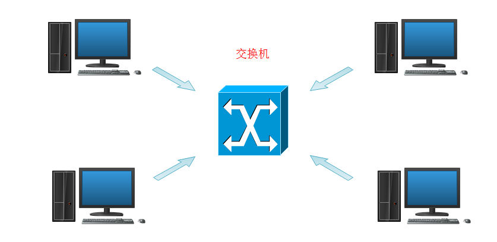
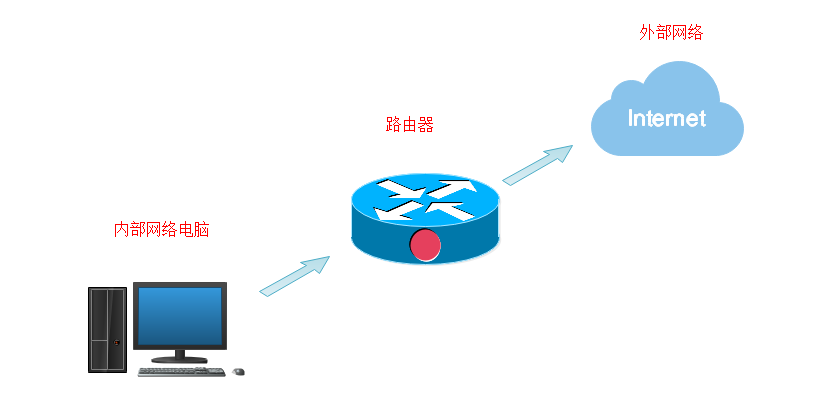
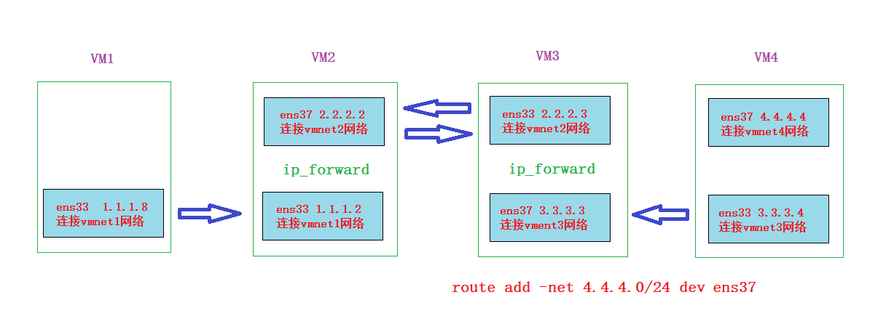
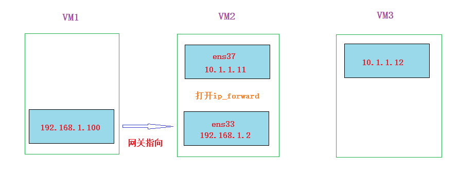
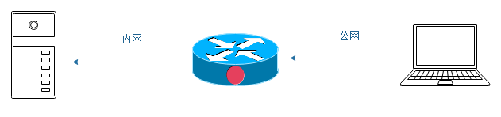
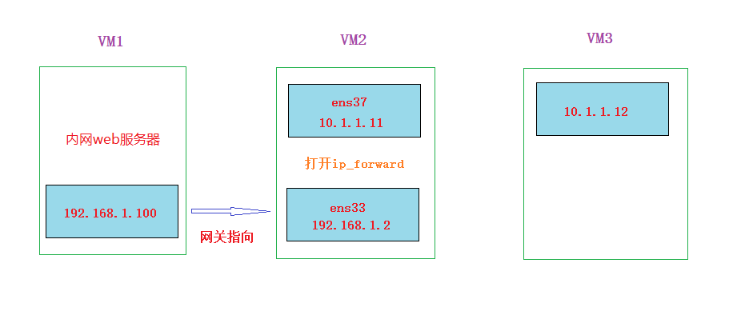

**学习目标**

- [ ] 掌握linux静态路由的网络分析方法

- [ ] 能够实现SNAT

- [ ] 能够实现DNAT

- [ ] 能够实现DNAT+DNPT


# linux网络

## 交换与路由

**交换**: 指同网络访问。两台机器连在同一个交换机上，配置同网段的不同ip就可以直接通迅 (这里不讨论三层交换).




**路由**: 指跨网络访问的路径选择





**路由表**: 指记录路由信息的表(可以单路由表，也可以多路由表)

~~~powershell
# route -n
Kernel IP routing table
Destination     Gateway         Genmask         Flags Metric Ref    Use Iface
0.0.0.0         10.1.1.2        0.0.0.0         UG    0      0        0 ens33
10.1.1.0        0.0.0.0         255.255.255.0   U     0      0        0 ens33
169.254.0.0     0.0.0.0         255.255.0.0     U     1002   0        0 ens33
192.168.122.0   0.0.0.0         255.255.255.0   U     0      0        0 virbr0
~~~


**问题1**: 按上面的路由表来看,如果要访问10.1.1.1这个IP,请问会怎么走?

~~~powershell
答:会通过10.1.1.0/255.255.255.0这个路由条目后面指示的ens33网卡去寻找10.1.1.1。
~~~

**问题2**: 按上面的路由表来看,如果要访问119.75.217.26这个IP,请问会怎么走?

~~~powershell
答:会通过网关10.1.1.2去寻找。
~~~

当在一台linux机器上要访问一个目标ip时，请记住linux以下**==四步口诀==**(**在linux默认的单路由表情况下**,如果想更深入了解多路由表,请看课外拓展内容):

1. **==如果本机有目标ip，则会直接访问本地; 如果本地没有目标ip，则看第2步==**
2. **==用route -n查看路由，如果路由条目里包含了目标ip的网段，则数据包就会从对应路由条目后面的网卡出去==**
3. **==如果没有对应网段的路由条目，则全部都走网关==**
4. **==如果网关也没有，则报错：网络不可达==**

（**注意:** 当不能直接到达目标ip, 那么每到达一个机器都会重复上面四步，直到找到目标) 


**问题3**: 为什么route -n能看到这几条路由(不同机器可能还不一样)

~~~powershell
因为本机网卡有相应的IP，就会默认产生相应的路由
如: ens33网IP为 10.1.1.11/24
那么则会默认产生如下路由条目
10.1.1.0     0.0.0.0    255.255.255.0   U     0      0        0 ens33
~~~

**问题4**: 加网关有什么要求?  如何加网关和删除网关?


加网关的要求:

* **==网关只能加路由条目里已有的路由网段里的一个IP (ping不通此IP都可以）==**

* **==加网关不需要指定子网掩码==**

临时配置与删除(立即生效,重启网络服务就没了)

~~~powershell
# route add default gw x.x.x.x
# route del default gw x.x.x.x
~~~

永久配置(**==如果机器有多张网卡,只需要一张网卡配置网关, 网关要与配置的网卡同网段==**)

~~~powershell
在/etc/sysconfig/network-scripts/ifcfg-ens33配置文件里加上
GATEWAY=x.x.x.x
~~~


## 静态路由

环境准备: 四个网段,四台机器(全部清空iptables规则)

* 1.1.1.0/24网段使用vmnet1网段来模拟(仅主机模式)
* 2.2.2.0/24网段使用vmnet2网段来模拟(仅主机模式)
* 3.3.3.0/24网段使用vmnet3网段来模拟(仅主机模式)
* 4.4.4.0/24网段使用vmnet4网段来模拟(仅主机模式)


**ip_forward**: linux内核里的一个参数.当两边机器不同网段IP通过中间双网卡机器进行路由交互时,需要将此参数值改为1,也就是打开ip_forward。打开方法如下:

临时修改,重启系统不生效

~~~powershell
临时修改方法1
# echo 1 > /proc/sys/net/ipv4/ip_forward
~~~

~~~powershell
临时修改方法2
# sysctl -w net.ipv4.ip_forward=1
~~~

永久修改

~~~powershell
# vim /etc/sysctl.conf
net.ipv4.ip_forward = 1				最后添加这一句

保存后使用下面命令使之生效
# sysctl -p
~~~

1. 在vm1上ping1.1.1.2,能不能通? 如果不能通怎么解决?

   **分析方法:** `源IP: 1.1.1.8  目标IP: 1.1.1.2`，按照前面的四步口诀，达到目标后，源和目标IP反转并能成功返回则表示能通; 否则不能通

~~~powershell
结果: 能通
~~~

2. 在前面ping通的基础上,继续在vm1上ping2.2.2.2,能不能通? 如果不能通怎么解决?

~~~powershell
结果: 不能通，过不去

解决: 在vm1上加网关指向1.1.1.2
~~~

3. 在前面ping通的基础上,继续在vm1上ping2.2.2.3,能不能通? 如果不能通怎么解决?

~~~powershell
结果: 不能通，回不来

解决: 在VM3上加网关指向2.2.2.2，并且在VM2上打开ip_forward
~~~

4. 在前面ping通的基础上,继续在vm1上ping3.3.3.3,能不能通? 如果不能通怎么解决?

~~~powershell
结果: 不通，过不去

解决: 在VM2上加网关指向2.2.2.3
~~~

5. 在前面ping通的基础上,继续在vm1上ping3.3.3.4,能不能通? 如果不能通怎么解决?

~~~powershell
结果: 不通,回不来

解决: 在VM4上加网关指向3.3.3.3，并且在VM3上打开ip_forward
~~~

6. 在前面ping通的基础上,继续在vm1上ping4.4.4.4,能不能通? 如果不能通怎么解决?

~~~powershell
结果: 不通，过不去

错误解决: 在VM3上加网关指向3.3.3.4
正确解决: 在vm3上加路由指向4.4.4.0/24网络
         route add -net 4.4.4.0/24 dev ens37
~~~




​                                                                                                                                                                                                                                                                                         

如果还有5网段，6网段，7网段.......，仅靠手动指网关和路由是不行的，所以需要专业的路由设备配置路由协议来实现(网络工程师)


 **学习建议:** 重点掌握网络分析方法

 **分析技巧总结:**

1. 先分清楚源与目标，如果1.1.1.8 ping 2.2.2.3,那么`SIP:1.1.1.8 DIP:2.2.2.3`
2. 在本机上按前面总结的4步口诀,找下一跳。比如通过本机指向的网关1.1.1.2跳到VM2机器
3. `SIP:1.1.1.8 DIP:2.2.2.3`数据包到达VM2后继续按4步口诀找下一跳，直到找到目的地
4. 到达目的地后，将SIP与DIP反转，变为`SIP:2.2.2.3 DIP:1.1.1.8`
5. 重复按4步口诀找下一跳，如果能最终回到1.1.1.8这台机器，那么表示可以通
6. 特殊情况: 当2个不同网络要经过(forward)中间的双网卡机器时，中间双网卡机器要打开ip_forward


# forward链

环境准备: 三台机器(都先清空iptables规则)


需要两个网络:如vmnet1和vmnet8

* vmnet1: 192.168.1.0/24	(仅主机模式)
* vmnet8: 10.1.1.0/24         (NAT模式)

此实验只需要两个网络,**不用关注是仅主机还是NAT模式**

**注意:** 192.168.1.0/24这个网络不要用windows下的NAT模式来模拟，因为NAT模式网段的第2个IP是用于上外网的网关，会和这里模拟的192.168.1.2冲突。


示例: 在中间VM2中禁止两边机器互ping

~~~powershell
# iptables -A FORWARD -p icmp -j DROP
~~~

示例: 禁止VM1访问VM3的80

~~~powershell
# iptables -A FORWARD -p tcp --dport 80 -s 192.168.1.100 -d 10.1.1.12 -j DROP
~~~


# NAT

NAT: (network address translate)网络地址转换


## SNAT

SNAT: (source network address translate)源网络地址转换


在前面forward链实验环境图的基础上思考一个问题，如果VM1模拟内网的一台电脑,VM2模拟一台上网的路由器，VM3模拟公网的一台服务器，请问公网服务器会把网关指向路由器吗?

~~~powershell
不会
解决: SNAT
~~~




**不做SNAT数据包走向分析过程:**

SIP:192.168.1.100		DIP:10.1.1.12

通过网关到达双网卡机器

SIP: 192.168.1.100		DIP:10.1.1.12

通过路由到达外网服务器，返回

SIP: 10.1.1.12			DIP:192.168.1.100

  

**做SNAT数据包走向分析过程:**

SIP:192.168.1.100		    DIP:10.1.1.12

通过网关到达双网卡机器，做**==SNAT==**

SIP:10.1.1.11	  	    		    DIP:10.1.1.12

通过路由到达外网服务器，返回

SIP:10.1.1.12		   	           DIP:10.1.1.11

回到双网卡机器后，会**==自动DNAT==**(自动的意思就是我们不用写规则)

SIP:10.1.1.12		   	           DIP:192.168.1.100


### iptables实现SNAT

在中间VM2上操作,两边机器都清空防火墙规则

~~~powershell
先确认没有任何规则
# systemctl stop firewalld
# iptables -t nat -F
~~~

方法1:

~~~powershell
# iptables -t nat -A POSTROUTING -o ens37 -j SNAT --to-source 10.1.1.11

--to-source可以简写为--to
SNAT和POSTROUTING和-o是固定搭配
~~~

方法2: 

~~~powershell
# iptables -t nat -A POSTROUTING -o ens37 -j MASQUERADE
MASQUERADE(伪装)可以动态SNAT.（用于公网IP不固定的情况，比如家用拔号上网）
~~~


### firewalld实现SNAT

在中间VM2上操作,两边机器都清空防火墙规则

```powershell
# iptables -t nat -F
# systemctl start firewalld

# firewall-cmd --add-masquerade			不用指从哪个网卡出了 
# firewall-cmd --remove-masquerade		删除的写法
```


**小结:**

**应用: 内网访问外网**

* 很多个私网IP转成1个公网IP共享上网，节省公网IP
* 伪装IP上网，不知道是哪个私网访问过来的，增强安全


## DNAT

DNAT: (destination network address translate )目标地址转换

问题:web服务器直接放在公网的话，那么域名就直接通过DNS解析到公网IP，客户就直接访问就可以了.

那把web服务器放在内网，有什么好处?

~~~powershell
答: 为了安全.可以通过前面的LB调度器进行调度，增强架构性能。
~~~






**做DNAT数据包走向分析过程:**

SIP: 10.1.1.12	        		 DIP:10.1.1.11

到达双网卡机器，做**==DNAT==**

SIP: 10.1.1.12				DIP: 192.168.1.100

通过路由，到达内网服务器，返回

SIP：192.168.1.100	    		 DIP：10.1.1.12

通过网关，回到路由器，**==自动SNAT==**

SIP：10.1.1.11	        		 DIP：10.1.1.12


### iptables实现DNAT

在中间VM2上操作,两边机器都清空防火墙规则

~~~powershell
先确认没有任何规则
# systemctl stop firewalld
# iptables -t nat -F
~~~

~~~powershell
# iptables -t nat -A PREROUTING -i ens37 -p tcp --dport 80 -j DNAT --to-destination 192.168.1.100
--to-destination可以简写为--to
DNAT和PREROUTING搭配
~~~


### firewalld实现DNAT

在中间VM2上操作,两边机器都清空防火墙规则

```powershell
# iptables -t nat -F
# systemctl start firewalld

# firewall-cmd --add-forward-port=port=80:proto=tcp:toaddr=192.168.1.100
```


**验证方法:**

1, 在VM1(模拟内网web)上安装httpd(需要本地yum源)

~~~powershell
# yum install httpd httpd-devel -y
# echo "内网主机 192.168.1.100" > /var/www/html/index.html
# systemctl restart httpd
~~~

2, 在VM2上实现上面的iptables的DNAT或firewalld的DNAT

3,在VM3(模拟外网客户端)上使用`curl 10.1.1.11`来验证(**==注意: IP为VM2模拟的公网IP==**)


## DNAT+DNPT

NPT:(network port translate)网络端口转换

在DNAT的场景基础上，把内网web服务器换一个端口(比如:8080)


### iptables实现DNAT+DNPT

方法1:

在中间VM2上操作实现DNAT, 两边机器都清空防火墙规则

~~~powershell
先确认没有任何规则
# systemctl stop firewalld
# iptables -t nat -F

# iptables -t nat -A PREROUTING -i ens37 -p tcp --dport 80 -j DNAT --to 192.168.1.100
~~~

再在模拟**内网的VM1**上操作实现DNPT（ens33为vm1单网卡的网卡名)

~~~powershell
# iptables -t nat -A PREROUTING -i ens33 -p tcp --dport 80 -j REDIRECT --to-port 8080
--to-port可以简写为--to
~~~

方法2:

直接在中间VM2上操作

~~~powershell
# iptables -t nat -A PREROUTING -i ens37 -p tcp --dport 80 -j DNAT --to 192.168.1.100:8080
~~~


### firewalld实现DNAT+DNPT

在中间VM2上操作,两边机器都清空防火墙规则

```powershell
# iptables -t nat -F
# systemctl start firewalld

# firewall-cmd --add-forward-port=port=80:proto=tcp:toaddr=192.168.1.100:toport=8080
```

