# 任务背景

* 公司不同机房的服务器之间有安全访问的需求。
* 不同分公司同事之间也有安全传输文件的需求。
* 公司出差用户在外有需要安全访问公司内部服务器的需求。
* 公司有海外业务需求。

以上需求，我们需要用到VPN(virtual private network)虚拟专用网络。


**学习目标**

- [ ] 能够通过隧道实现网对网的访问

- [ ] 能区分网对网和点对网两种VPN架构的应用场景

- [ ] 能够用libreswan实现网对网的VPN

- [ ] 能够用openvpn实现点对网的VPN


# 隧道

问题: 一家公司假设有两个分部，深圳与北京。两个分部的员工在各自己的局域网办公，如果深圳的员工和北京的员工要通过网络安全传输数据，怎么做？

答案:

1. 使用gpg2通过非对称加密和数字签名来实现（太麻烦了）
2. 使用SSL/TLS来实现（可以，但需要搭建VPN）
3. 将两个分部的网络通过在公网建立虚链路来连接（可以，也就是网对网VPN）


网对网VPN(virtual private network)

点对网VPN


## 隧道介绍

> 什么是隧道(tunnel)?
>
> 答: 是一种通迅协议。就是一种在物理网络上建立==**虚链路**==的方式。通俗点说，就像在公路上开辟了一条你的专用车道，当然这是一条虚拟的车道，你可以看作就像是物理上有这么一条车道，走什么车你说了算。用隧道的好处就是你可以对其加密，就可以变成专用的加密链路了（也就是VPN）; 缺点就用隧道协议会造成传输数据包的==**额外开销**==。 

```powershell
参考文档: LARTC-zh_CN.GB2312.pdf 里的第五章节
```

加密的隧道就可以看作是网对网的VPN

## net-to-net隧道通迅


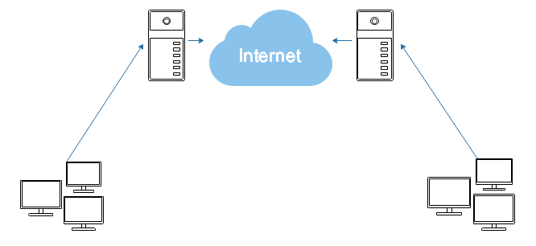

**实验准备:**需要准备4台虚拟机,三个网段

1. 192.168.100.0/24   深圳内网    vmnet1
2. 10.1.1.0/24   	          公网        vmnet8
3. 192.168.101.0/24   北京内网   vmnet2


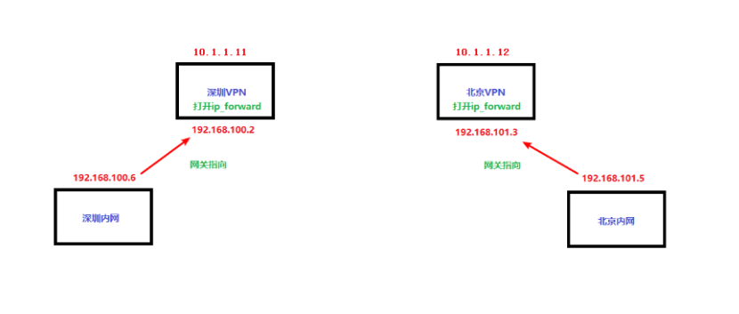

问题：准备好上面四台机器后，不做隧道如何实现左右两边内网的通讯?

~~~powershell
再次回顾并记住四步口诀:
1，如果本机有目标ip，则会直接访问本地;如果本地没有目标ip，则看第2步
2，用route -n查看路由，如果路由条目里包含了目标ip的网段，则数据包就会从对应路由条目后面的网卡出去
3，如果没有对应网段的路由条目，则全部都走网关
4，如果网关也没有，则报错：网络不可达
~~~

答案:  把深圳外网和北京外网互指网关就可以了（两台外网服务器也需要打开ip_forward)。但实际环境中这样互指网关不太现实，所以通过建立虚链路，然后在虚链路里走路由来实现。


**实验步骤:**

1. 两台外网服务器上打开ip_forward,并装载ip_gre隧道模块
2. 两台外网服务器上增加隧道网卡,并启动网卡
3. 两台外网服务器上配置隧道IP使之通讯（打通隧道）
4. 两台外网服务器上指定走隧道的路由（让隧道两头的内网能通过隧道通讯）
5. 两边内网连通测试

**实验过程:** 

第1步: 先在深圳和北京两台VPN服务器上打开ip_forword,并装载ip_gre隧道模块

~~~powershell
＃ vim /etc/sysctl.conf		
net.ipv4.ip_forward = 1		
＃ sysctl -p

szvpn# modprobe ip_gre						--加载此隧道模块
szvpn# lsmod |grep gre						--确认有此隧道模块
ip_gre                 15341  0

bjvpn# modprobe ip_gre
bjvpn# lsmod |grep gre
ip_gre                 15341  0
~~~

第2步: 两台VPN服务器上增加隧道网卡,并启动网卡

~~~powershell
szvpn# ip tunnel add tun0 mode gre  remote 10.1.1.12 local 10.1.1.11     --增加一个tun0接口,隧道模式为gre,由本端的10.1.1.11和对端的10.1.1.12这个物理连接上建立
szvpn# ip link set tun0 up						--或者使用ifconfig tun0 up

bjvpn# ip tunnel add tun0 mode gre  remote 10.1.1.11 local 10.1.1.12
bjvpn# ifconfig tun0 up
~~~

第3步: 两台外网服务器上配置隧道IP使之通讯（打通隧道）

给本地的tun0授于IP为192.168.105.3,对端为192.168.105.4;

完成后ifconfig就能看到tun0的IP(这两个ip是用于tunnel的点对点连接用的，**定义的ip只要满足能通迅，并且不和其它网卡路由冲突就行**)

~~~powershell
szvpn# ip addr add 192.168.105.3 peer 192.168.105.4 dev tun0

bjvpn# ip addr add 192.168.105.4 peer 192.168.105.3 dev tun0
~~~

第4步: 两台外网服务器上指定走隧道的路由（让隧道两头的内网能通过隧道通讯）

~~~powershell
szvpn# ip route add 192.168.101.0/24 dev tun0  	
或者使用route add -net 192.168.101.0/24 dev tun0命令也是相同效果

bjvpn# ip route add 192.168.100.0/24 dev tun0
~~~

第5步: 两边内网连接测试

~~~powershell
北京内网机器和深圳内网机器的两个内网IP可以互相ping通了，并且可以使用traceroute 命令接IP，查看确实走了tunnel
~~~


**补充:**

测试完后，删除tunnel的方法`ip tunnel del tun0`
如果做的实验有问题,可以用`ip tunnel del tun0`命令删除后,重新再做


**注意:**

上面架构做好后，深圳内网用户192.168.100.6ping不通10.1.1.12(北京vpn外网IP),但反过来(就是北京vpn可以ping通深圳内网用户)却可以ping通。


# VPN

## net-to-net VPN

> 上次的隧道实例在传输过程中是没有加密的，加密后就是网对网的VPN（Virtual Private Network）了。如何加密？
>
> 答: 可以使用==**IPSec**==协议来进行加密。
>
> IPSec是什么? 
>
> 答: IPSec(Internet Protocol Security, Internet 协议安全性) 一组IP安全协议集, 通过使用加密的安全服务以确保在 Internet 协议 (IP) 网络上进行保密而安全的通讯。我们这里主要的应用就是**==IPSec VPN==**。IPSEC的加密通信中包含了两个组件，分别为AH(Authentication header验证包头),用于对端验证，**==ESP==**(Encapsulating security payload,封装安全载荷)协议，用于加密。
>
> 如何实现IPSec VPN?
>
> 答: linux上相应的开源软件有freeswan,strongswan,openswan,libreswan等。目前centos7的镜像文件里自带的软件为**==libreswan==**。


### libreswan实现net-to-netVPN


**实验准备**: 四台虚拟机，和隧道实验的一样。可以直接接着隧道实验继续做


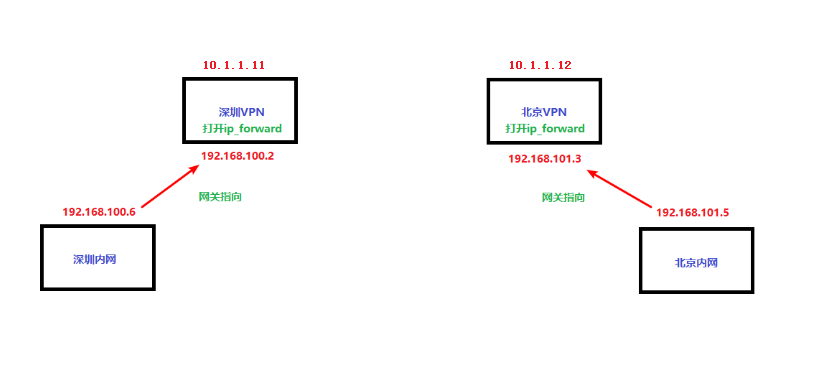

**实验步骤**:

1. 把隧道先删除（如果是新准备的环境没有隧道环境，无视这一步)

~~~powershell
先使用ip tunnel del tun0把上面做的tunnel给删除掉,确认深圳与北京内网不能互通。而下面我们的目的就是要让它们互通，并且加密传输
# ip tunnel del tun0
~~~

2. 两地VPN服务器上安装libreswan软件包

~~~powershell
本地源就可以安装以下包（先使用rpm -qa |grep libreswan查一下，默认可能已经安装了)
# yum install libreswan
~~~

3. 两地VPN服务器上分别产生加密传输所需要的密钥

~~~powershell
(我这里定义深圳为left,北京为right)
szvpn# rm /etc/ipsec.d/*.db -rf
szvpn# ipsec initnss
szvpn# rm /etc/ipsec.secrets  -rf

szvpn# ipsec newhostkey --output /etc/ipsec.secrets
Generated RSA key pair with CKAID b24219f0e84b0aaa6e3b054c707e1993c0c1c78d was stored in the NSS database
szvpn# ipsec showhostkey --left --ckaid b24219f0e84b0aaa6e3b054c707e1993c0c1c78d
	# rsakey AwEAAdbBY
	leftrsasigkey=0sAwEAAdbBYBxjW......
~~~

~~~powershell
bjvpn# rm /etc/ipsec.d/*.db -rf
bjvpn# ipsec initnss
bjvpn# rm /etc/ipsec.secrets  -rf

bjvpn# ipsec newhostkey --output /etc/ipsec.secrets
Generated RSA key pair with CKAID 4554a9f0e84b0abc553b054c707e1993c0cac75e was stored in the NSS database

bjvpn# ipsec showhostkey --right --ckaid 4554a9f0e84b0abc553b054c707e1993c0cac75e
	# rsakey AQPtd7QeG
	rightrsasigkey=0sAQPtd7QeG.......
~~~

4. 配置两地VPN服务器（主要配置两地的公网IP，内网网段，密钥等）

   自己建立一个子配置文件，名字以.conf结尾就行

~~~powershell
# vim /etc/ipsec.d/sz-to-bj.conf

conn sz-to-bj								--一个vpn连接的名称，名字随意

        leftid=@szvpn						--左vpn的id标识，按格式，名字随意
        left=10.1.1.11						--左vpn的公网ip
        leftsubnet=192.168.100.0/24			--左vpn的内网网段
        leftrsasigkey=0sAQOwU+sNIT......	--前面第二步在左vpn上得到的leftkey(最好复制粘贴过来)

        rightid=@bjvpn
        right=10.1.1.12
        rightsubnet=192.168.101.0/24
        rightrsasigkey=0sAQPtd7QeG......

        auto=start							--启动服务时，会自动启动这个连接
~~~

scp把配置文件拷给另外一台，路径保持一致，内容不用修改

~~~powershell
# scp /etc/ipsec.d/sz-to-bj.conf 10.1.1.12:/etc/ipsec.d/	  
~~~

5. 启动两地的VPN服务(服务名称为ipsec)

~~~powershell
# systemctl start ipsec
# systemctl enable ipsec
# systemctl status ipsec
~~~

6. 测试

```powershell
还要注意两点:
a),把两台vpn服务器的ip_forward打开
b),两台vpn服务器上要随便加一个网关（这个网关ip可以不存在都行)
--原因是这个网关是默认的下一跳地址，实际环境指的就是前端路由出口，但我们这里是把10.1.1.11和10.1.1.12直接模拟公网ip,所以就不需要前端路由。但是这个软件还是要加一个网关才行

然后两边的内网就可以互相ping通了

在两台vpn服务器上tcpdump抓包可以看到有ipsec的加密 
# tcpdump -i ens33 host 10.1.1.11 and 10.1.1.12 -n
tcpdump: verbose output suppressed, use -v or -vv for full protocol decode
listening on ens33, link-type EN10MB (Ethernet), capture size 65535 bytes
12:15:10.535976 IP 10.1.1.11 > 10.1.1.12: ESP(spi=0x4255583a,seq=0x179), length 132
12:15:10.536429 IP 10.1.1.11 > 10.1.1.12: ESP(spi=0xd97b1499,seq=0x179), length 132
12:15:10.873037 IP 10.1.1.11 > 10.1.1.12: ESP(spi=0xd97b1499,seq=0x17a), length 132
12:15:10.873392 IP 10.1.1.11 > 10.1.1.12: ESP(spi=0x4255583a,seq=0x17a), length 132
12:15:11.536145 IP 10.1.1.11 > 10.1.1.12: ESP(spi=0x4255583a,seq=0x17b), length 132
12:15:11.536668 IP 10.1.1.11 > 10.1.1.12: ESP(spi=0xd97b1499,seq=0x17b), length 132
12:15:11.873129 IP 10.1.1.11 > 10.1.1.12: ESP(spi=0xd97b1499,seq=0x17c), length 132
12:15:11.873679 IP 10.1.1.11 > 10.1.1.12: ESP(spi=0x4255583a,seq=0x17c), length 132

抓包里看到有ESP的信息则表示隧道加密了
```


问题: 上面做的是深圳，北京两地的局域网互连，如果再加一个上海，怎么实现sz,bj,sh三地局域网的vpn互联呢?

答:  两两互联。


### 三网络VPN互联(拓展)

~~~powershell
   深圳			      	   北京						 上海

  10.1.1.11		   			10.1.1.12		   		10.1.1.13	
     外1			        	外2						   外3
192.168.100.2		      192.168.101.3	     		192.168.102.4


     内1						  内2						内3
192.168.100.6		      192.168.101.5	     		192.168.102.5
网关指向192.168.100.2	  网关指向192.168.101.3    网关指向192.168.102.4
~~~

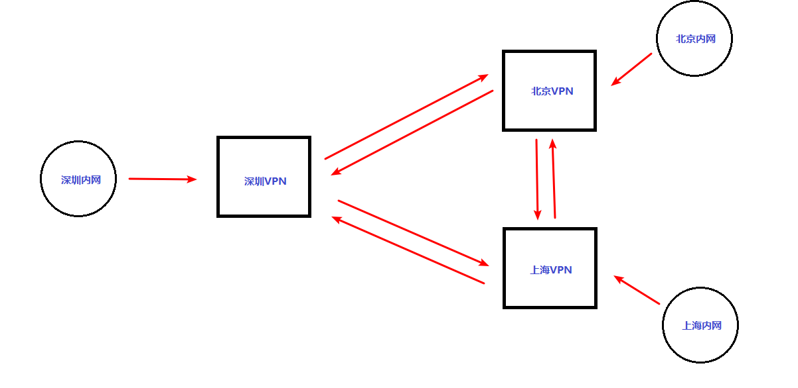

~~~powershell
深圳VPN
sz-to-bj
sz-to-sh
北京VPN
sz-to-bj
bj-to-sh
上海VPN
sz-to-sh
bj-to-sh
~~~

~~~powershell
深圳VPN
sz-to-bj
sz-to-sh
bj-to-sh
北京VPN
sz-to-bj
sz-to-sh
bj-to-sh
上海VPN
sz-to-bj
sz-to-sh
bj-to-sh
~~~

**小结:**

网对网VPN=隧道(ip_gre)+加密(ipsec)


## roadwarrior VPN

问题: 如果我出差在外住酒店，也要有和公司内网有安全传输的需求，如何实现？


> 什么是roadwarrior VPN？
>
> 答: raodwarrior在这里指的是出差的人。所以这种模式的VPN是指出差的人在外地通过VPN可以连接到公司网络。

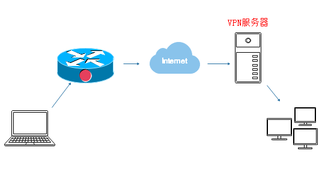

主要应用场景为以下几种

* 科学上网

~~~powershell
国内用户　－－》 因特网　－－》 国外VPN服务器　－－》　facebook,youtube等
~~~

* 出差员工在外任何地方（只要有网络）就可以通过加密链路连接到公司内网

~~~powershell
出差用户windows－－》酒店路由器－－》公司VPN服务器 －－》公司内网服务器
~~~

* 运维人员在外或在家就可以办公

~~~powershell
在家运维人员　－－》 家里路由器－－》公司VPN服务器（防火墙,堡垒机,跳板机,审计等)－－》公司内部被管理的服务器集
~~~


### libreswan实现点对网VPN(拓展)

 仍然使用上例用到的结构图（ip不变，但角色变了）


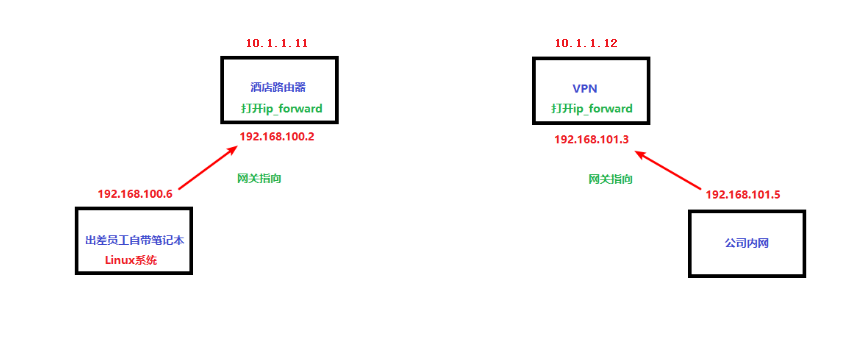

**实验准备:**

1, 在酒店路由器上`systemctl stop ipsec.service`;还要把网关也删除掉。因为现在它是默认酒店的一个路由器,你不可能在上面安装libreswan; 

2, 需要在酒店路由器做一个SNAT伪装，让员工能上外网

~~~powershell
# systemctl  start firewalld
# systemctl  enable firewalld
# firewall-cmd --add-masquerade	
# firewall-cmd --runtime-to-permanent
~~~

3, VPN服务器上再次确认打开ip_forward

~~~powershell
# vim /etc/sysctl.conf
net.ipv4.ip_forward = 1
# sysctl -p  
保存退出后,用此使用使之生效
~~~

做完上面的准备工作后，出差员工在192.168.100.6上能ping通10.1.1.12公司VPN服务器公网IP了，但ping不通192.168.101.5公司内网服务器，所以需要做VPN拔号上去


**实验步骤**:

1. 在出差员工笔记本上和VPN服务器上安装libreswan
2. 在出差员工笔记本上和VPN服务器上产生加密传输所需的密钥
3. 在出差员工笔记本上和VPN服务器上配置
4. 在出差员工笔记本上和VPN服务器上启动服务
5. 验证

第1步: 在192.168.100.6(这里模拟出差的员工带的笔记本)上安装libreswan

~~~powershell
# yum install libreswan
~~~

第2步: 在192.168.100.6(出差员工电脑)和10.1.1.12(公司VPN服务器)上配置libreswan的leftkey和rightkey

~~~powershell
在192.168.100.6(出差员工电脑)上的步骤

# rm /etc/ipsec.d/*.db -rf
# ipsec initnss
# rm /etc/ipsec.secrets  -rf

# ipsec newhostkey --output /etc/ipsec.secrets
Generated RSA key pair with CKAID b24219f0e84b0aaa6e3b054c707e1993c0c1c78d was stored in the NSS database

# ipsec showhostkey --left --ckaid b24219f0e84b0aaa6e3b054c707e1993c0c1c78d
	leftrsasigkey=0sAQO8q6mzHW......
~~~

~~~powershell
在10.1.1.12（公司VPN服务器)上的步骤
# rm /etc/ipsec.d/*.db -rf
# ipsec initnss
# rm /etc/ipsec.secrets  -rf

# ipsec newhostkey --output /etc/ipsec.secrets
Generated RSA key pair with CKAID 4554a9f0e84b0abc553b054c707e1993c0cac75e was stored in the NSS database

# ipsec showhostkey --right --ckaid 4554a9f0e84b0abc553b054c707e1993c0cac75e
rightrsasigkey=0sAQPCb+Wdc7......
~~~

第3步: 配置客户端和VPN服务器的ipsec.conf主配置文件

~~~powershell
先在出差用户的笔记本上(192.168.100.6)配置
# vim /etc/ipsec.d/roadwarrior.conf	--手动增加这个子配置文件

conn zhangsan
		left=%defaultroute			--因为在外出差,酒店的公网IP不固定,所以这里直接指向你的网关就行
		leftid=@zhangsan			--对你的笔记本做一个标识ID,只要和vpn服务器不一样就行,名字随意
		leftrsasigkey=0sAQO8q6mzHW......	--这里的leftkey就是在员工笔记本上得到的key(你在笔记本上--left和--right显示的key是一样的)	
		right=10.1.1.12	--VPN服务器公网IP,要求IP是固定的
		rightid=@vpnserver	--vpn服务器的标识ID,名字随意
		rightsubnet=192.168.101.0/24	  --公司的内网网段(再次提一下,192.168.101.0实际上是公网网段,我这里是实验环境而已)
		rightrsasigkey=0sAQPCb+Wdc7.....	--这里是rightkey就是在VPN服务器上得到的key(使用--left和--right也是一样的,同一台服务器左和右显示的key是一样的)
		auto=start	--表示启动服务时,自动连接.如果笔记本chkconfig ipsec on,那么开机就会自动vpn连上公司
~~~

~~~powershell
再在vpn服务器(10.1.1.12)上配置
# rm  /etc/ipsec.d/sz-to-bj.conf -rf   --先删除前面实验的配置文件
# vim /etc/ipsec.d/roadwarrior.conf	--加上下面一段

conn zhangsan
		left=10.1.1.12		--这里VPN服务器公网IP（注意这里left和right换了角色了，在这里vpnserver为left,出差客户端为right)
		leftid=@vpnserver
		leftsubnet=192.168.101.0/24
		leftrsasigkey=0sAQPCb+Wdc7......	--这是vpn服务器上--left得到的key,和--right是一样的key(只是前面的前缀不一样而已）
		right=%any						--因为不知道客户端的公网IP(动态的),所以用%any
		rightsubnet=vhost:%priv,%no		--这句话很重要,如果出差用户是在一个NAT后面(在路由器后面).也就是说出差用户用的是私网IP,那么这句话就是支持这种情况用的
		rightid=@zhangsan
		rightrsasigkey=0sAQO8q6mzH......	--这是出差用户--right得到的key,和--left是一样
		auto=start
~~~

第4步: vpn服务器和用户客户端都启动服务

~~~powershell
# systemctl start ipsec.service
~~~

第5步: 测试

```powershell
vpn服务器还是随便指一个网关(这个问题在上例中有解释)
客户端(192.168.100.6)就可以ping通192.168.101.5这个公司内网了
```


问题: 这个VPN实验在实际应用时有哪些缺点？

1.  客户端必须是linux
2.  如果100个人要出差，那么需要维护100对密钥。


> 什么是SSL VPN?
>
> 答: 与复杂的IPSec VPN相比，SSL通过简单易用的方法实现信息远程连通。典型的Linux下的开源软件OpenVPN就是一个基于 OpenSSL 库的应用层 VPN实现，它就可以解决上面实验的缺点。

### openvpn实现点对网vpn


**实验准备**: 重点是模拟出差员工的电脑要换成windows（要求时间都要同步）

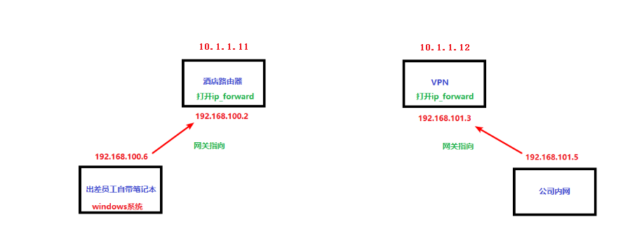

**准备工作:**

1,把上面实验的服务关闭

~~~powershell
# systemctl stop ipsec.service
# systemctl status ipsec.service
# systemctl disable ipsec.service
~~~

2,windows系统模拟出差员工客户端，网关要指向酒店路由器

(dns这里可以不用指，实际情况就直接指向类似114.114.114.114这种的服务器)

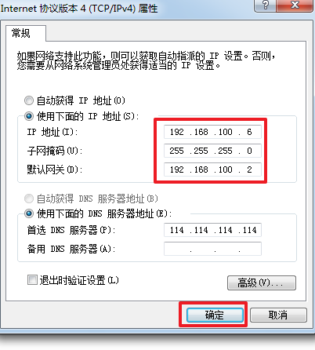


3,在酒店路由器做snat，让内网能够上外网，也就是能够访问到10.1.1.12这个vpn服务器公网ip

~~~powershell
# systemctl  start firewalld
# systemctl  enable firewalld
# firewall-cmd --add-masquerade		
增加SNAT,立即生效(如果不能立即生效，请再执行下面两句)

# firewall-cmd --runtime-to-permanent
# systemctl  restart firewalld
~~~

4, 在酒店路由器上和VPN服务器都要确认打开ip_forward

5, 在模拟员工出差笔记本的这台机器，尝试ping 10.1.1.12，能ping通则表示ok
但现在ping不通192.168.101.5(这也是我们做这个点对网vpn的目的)

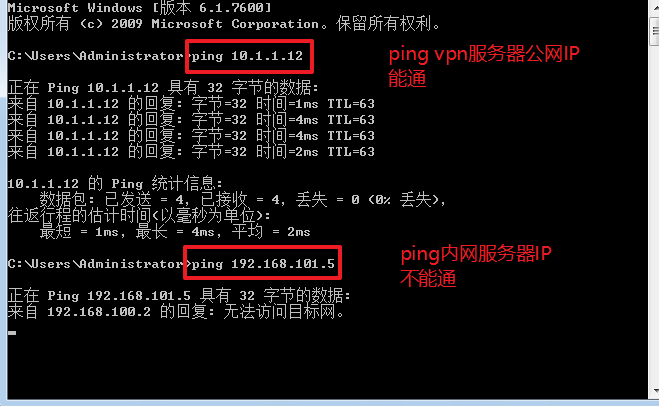


**实验步骤:**

1. 在VPN服务器上安装openvpn服务端软件和产生SSL证书的工具

   将共享的软件包上传到vpn服务器上安装

~~~powershell
vpnserver# rpm -ivh pkcs11-helper-1.11-3.el7.x86_64.rpm
vpnserver# rpm -ivh openvpn-2.4.2-2.el7.x86_64.rpm
vpnserver# rpm -ivh easy-rsa-2.2.2-1.el7.noarch.rpm
~~~

2. 产生相关证书(建议不要纠结细节,只要知道这一大步是产生相关证书就好)

~~~powershell
拷贝easy-rsa目录到openvpn的主配置目录下,并创建相关密钥
vpnserver# cp -rf /usr/share/easy-rsa/2.0/ /etc/openvpn/
vpnserver# cd /etc/openvpn/2.0/

修改生成证书的信息，为了后面生成证书方便
vpnserver# vim vars					
export KEY_COUNTRY="CN"
export KEY_PROVINCE="BJ"
export KEY_CITY="bj"
export KEY_ORG="itcast"
export KEY_EMAIL="daniel@itcast.cn"
export KEY_OU="IT"

vpnserver# cp openssl-1.0.0.cnf openssl.cnf
vpnserver# source vars 
NOTE: If you run ./clean-all, I will be doing a rm -rf on /etc/openvpn/2.0/keys
vpnserver# ./clean-all 
执行这句,如果你以前做过keys的话,那么它会帮你删除以前做在/etc/openvpn/2.0/keys目录里的密钥文件.如果你是第一次,它会帮你产生这个目录

生成ssl证书
vpnserver# ./build-ca
生成服务器证书
vpnserver# ./build-key-server server  			--名字也是随意(但是在后面的配置文件里要对应上)
生成客户端证书
vpnserver# ./build-key client 		
生成dh
vpnserver# ./build-dh     			--Diffie hellman（一种确保共享KEY安全穿越不安全网络的方法）

做完之后，确认一共有17个文件，个数不对，表示生成证书步骤有问题，从./clean-all这步重做
vpnserver# ls keys/ |wc -l
17
~~~

3. 配置VPN服务器配置文件

~~~powershell
拷贝主配置文件模版，并修改配置
vpnserver# cp /usr/share/doc/openvpn-2.4.2/sample/sample-config-files/server.conf /etc/openvpn/
vpnserver# vim /etc/openvpn/server.conf

32 port 1194
36 proto udp
53 dev tun
78 ca /etc/openvpn/2.0/keys/ca.crt
79 cert /etc/openvpn/2.0/keys/server.crt
80 key /etc/openvpn/2.0/keys/server.key 	--路径不要写错
85 dh /etc/openvpn/2.0/keys/dh2048.pem
101 server 10.8.0.0 255.255.255.0	--服务器端tun0网卡所在网段，和分配拔号成功的客户端IP所在网段，也就是他们隧道通迅的网段
142 push "route 192.168.101.0 255.255.255.0"	--拔号后给他加一个路由,192.168.101.0就是公司的内网网段
209 client-to-client	--多客户端能互相访问
244 #tls-auth ta.key 0	--注释这一句
263 comp-lzo
267 max-clients 100		--允许的最大客户端数
~~~

4. 启动VPN服务器

~~~powershell
VPN服务器上启动服务
vpnserver# systemctl start openvpn@server.service
vpnserver# systemctl status openvpn@server.service
vpnserver# systemctl enable openvpn@server.service

ifconfig tun0  --可以看到下面的信息
tun0: flags=4305<UP,POINTOPOINT,RUNNING,NOARP,MULTICAST>  mtu 1500
        inet 10.8.0.1  netmask 255.255.255.255  destination 10.8.0.2
~~~

5. windows客户端下载openvpn客户端软件和相应的证书文件

~~~powershell
把客户端证书和openvpn客户端软件拷贝到windows客户端
要拷的文件有：
/etc/openvpn/2.0/keys/
client.crt
client.key
ca.crt 

openvpn-install-2.4.2-I601.exe
~~~

6. winows客户端安装openvpn客户端软件

~~~powershell
在windows客户端先双击安装openvpn-install-2.4.2-I601.exe(需要安装网络适配器,但不用安装.net)

我的openvpn默认安装路径为C:\Program Files\OpenVPN\
所以把client.crt,client.key,ca.crt三个文件拷贝到C:\Program Files\OpenVPN\config目录
还要把C:\Program Files\OpenVPN\sample-config\里的client文件也拷到
C:\Program Files\OpenVPN\config目录
~~~

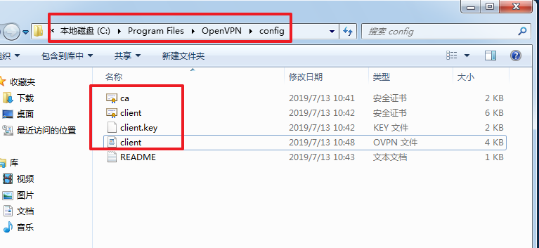


7. windows客户端配置连接的服务器和相应证书

~~~powershell
配置client配置文件
用写字板程序打开client配置文件（如果没有写字板，可以使用word打开）

client
dev tun
proto udp
remote 10.1.1.12 1194       --10.1.1.12为VPN服务器通向外网的公网IP
resolv-retry infinite
nobind
persist-key
persist-tun
ca ca.crt
cert client.crt
key client.key			--这三个文件的路径要对应好，我都在config目录下，所以这里是相对路径
comp-lzo		    	--这一句也要必须打开注释（对应服务器那边的配置)
#tls-auth ta.key 1		--注释这一句
~~~

8. 连接测试

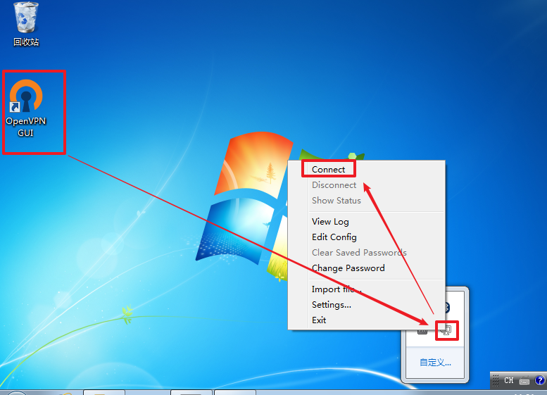


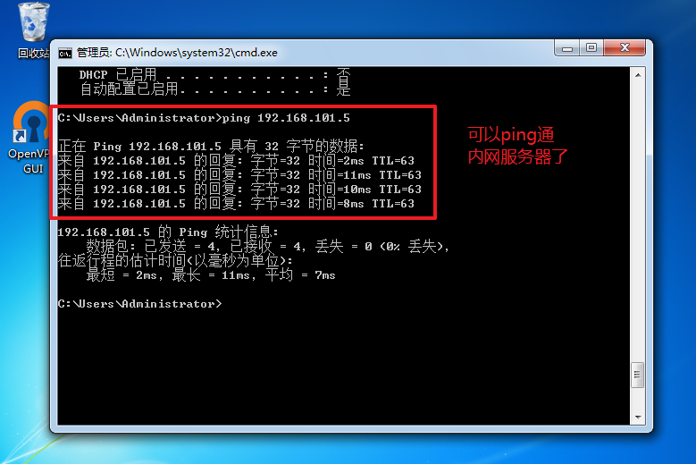


> 注意1：客户端和服务器时间一定要同步，否则拔号时TLS握手失败
> 注意2：注意这几个文件的后缀名和文件类型，要确认是证书文件和key文件（如果不是，可能是保存时的类型不对，再改后缀名就好)


**拓展1: **如果公司有多个不同分部(北京,深圳,上海)的vpn服务器怎么做？

~~~powershell
答案:
客户端做多个配置文件(名字不一样就行)，就配置连接vpn服务器的ip不同,证书不同就可以了
~~~

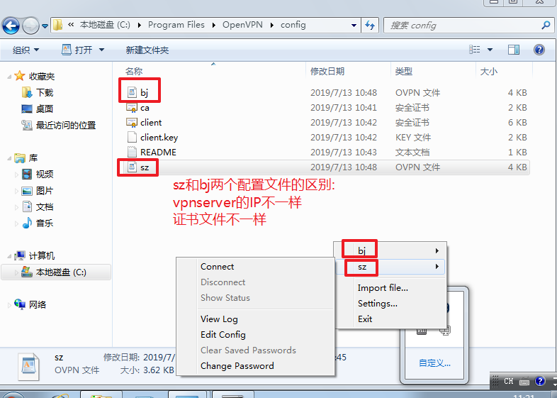


**拓展2:** 这样做的VPN,只要能下载到客户端的SSL证书就可以连接VPN服务器了, 还是不够安全。能否加上**验证**的功能？

1, 在openvpn配置文件最后加上下面几句

~~~powershell
# vim /etc/openvpn/server.conf

script-security 3
auth-user-pass-verify /etc/openvpn/checkpsw.sh via-env
client-cert-not-required
username-as-common-name
~~~

2, 创建此脚本文件，直接复制下面一大段

```powershell
#!/bin/sh

PASSFILE="/etc/openvpn/psw-file"
LOG_FILE="/var/log/openvpn/openvpn-password.log"
mkdir /var/log/openvpn/ -p
TIME_STAMP=`date "+%Y-%m-%d %T"`


if [ ! -r "${PASSFILE}" ]; then
echo "${TIME_STAMP}: Could not open password file \"${PASSFILE}\" for reading.">> ${LOG_FILE}
  exit 1
fi

CORRECT_PASSWORD=`awk '!/^;/&&!/^#/&&$1=="'${username}'"{print $2;exit}' ${PASSFILE}`

if [ "${CORRECT_PASSWORD}" = "" ]; then
echo "${TIME_STAMP}: User does not exist: username=\"${username}\", password=\"${password}\"." >> ${LOG_FILE}
  exit 1
fi

if [ "${password}" = "${CORRECT_PASSWORD}" ]; then
 echo "${TIME_STAMP}: Successful: username=\"${username}\"." >> ${LOG_FILE}
  exit 0
fi

echo "${TIME_STAMP}: Incorrect password: username=\"${username}\", password=\"${password}\"." >> ${LOG_FILE}
exit 1

# chmod 755 /etc/openvpn/checkpsw.sh	
给脚本执行权限　
```

3, 产生密码文件并添加验证用户和密码

~~~powershell
# echo "testuser 123" > /etc/openvpn/psw-file	
产生密码文件（路径不能乱改，和上面脚本要对应，多个用户名和密码，一行一个)
# chmod 600 /etc/openvpn/psw-file				
为了安全，密码文件给600权限
~~~

4, 在windows客户端配置文件的最后也加上下面两句

~~~powershell
auth-user-pass
reneg-sec 360000
~~~

5, vpn服务器上重启服务

~~~powershell
# systemctl restart openvpn@server.service 
~~~

6, 测试

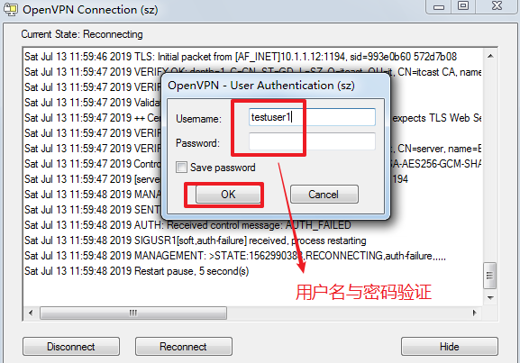


**修改后的简单脚本写法(参考)**

~~~powershell
#!/bin/sh

PASSFILE="/etc/openvpn/psw-file"
LOG_FILE="/var/log/openvpn/openvpn-password.log"
TIME_STAMP=`date "+%F %T"`

mkdir /var/log/openvpn/ -p

if [ ! -r $PASSFILE ]; then
        echo "$TIME_STAMP: 密码文件$PASSFILE不可读" >> $LOG_FILE
        exit 1
fi

CORRECT_PASSWORD=`awk '$1=="'$username'" {print $2}' $PASSFILE`

if [ $CORRECT_PASSWORD = "" ]; then
        echo "$TIME_STAMP: $username没有密码" >> $LOG_FILE
        exit 2
fi

if [ $password = $CORRECT_PASSWORD ]; then
        echo "$TIME_STAMP: $username成功登录" >> $LOG_FILE
        exit 0
fi

echo "$TIME_STAMP: $username密码不正确" >> $LOG_FILE
exit 1

~~~


总结性问题: 下面这几种网络安全传输的应用有哪些区别？

1. 使用gpg2软件网络上使用非对称加密和数字签名实现安全传输(个人与个人)
2. 使用https实现安全传输（客户与网站或应用）
3. 使用VPN实现安全传输 （网对网，点对网）


> 什么是pptp?
>
> 答: 点对点隧道协议PPTP(Point to Point Tunneling Protocol)是一种支持多协议虚拟专用网络的网络技术。


### 使用pptpd实现VPN(拓展)


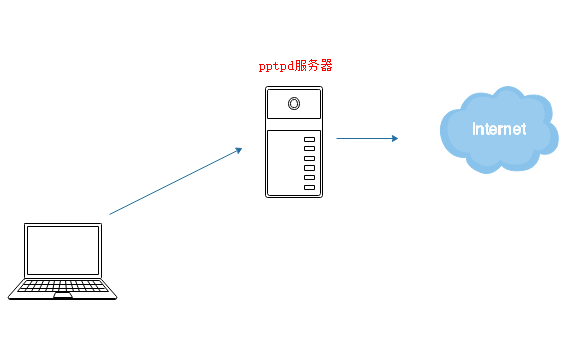

**实验步骤:**

1. 在pptpd服务器上安装相关软件包,并打开ip_forward
2. 配置pptpd相关配置文件
3. 在pptpd服务器上启动服务
4. windows客户端配置连接
5. 连接测试

~~~powershell
									10.1.1.11   	 		这是能上外网的IP
		 windows				pptpd服务器(打开ip_forward)		
	 192.168.100.6					192.168.100.3   	 	这是私有内网网络
~~~

**实现目的:**
让windows虚拟机通过pptpd的vpn拔号，能够上外网


**实验步骤:**

第1步: 在pptpd服务器上安装软件包(需要本地yum源和epel源),并确认打开ip_forward

~~~powershell
# yum install ppp pptpd -y

# vim /etc/sysctl.conf
net.ipv4.ip_forward = 1	--改为1
# sysctl -p 
~~~

第2步: 配置pptpd相关配置文件

~~~powershell
# vim /etc/ppp/options.pptpd			
67 ms-dns 114.114.114.114  --打开注释，并写上公网的DNS服务器IP						

# vim /etc/pptpd.conf	
12 ppp /usr/sbin/pppd	--打开这一行的注释

102 localip 10.1.1.11		--最后写上这两句（localip要写vpn服务器上外网的IP）
103 remoteip 192.168.72.10-100	--写一个分配给客户端拔号的IP范围
	
# vim /etc/ppp/chap-secrets	 --写上可以拔号vpn服务器的用户名和密码
test    pptpd   123456  *	 --代表用户名为test,密码为123456;pptpd表示服务名，*表示所有人能连
~~~

第3步: 服务器启动服务

~~~powershell
# systemctl restart pptpd
~~~

第4步: windows客户端配置连接

~~~powershell
winXP客户端配置
右键网上邻居－－》属性－－》创建一个新的连接－－》下一步－－》连接到我的工作场所－－》下一步－－》虚拟专用网络连接－－》下一步－－》填一个随意的连接名(如:zhangsan)－－》填vpn内网的IP（这里就是192.168.100.1)－－>下一步－－》填用户名(test),密码(123456)－－》点连接

win7客户端配置
右下角打开网络和共享中心－－》设置新的连接和网络－－》连接到工作区(VPN)－－》使用我的internet连接(VPN)－－》internet地址(填写vpn服务器内网的ip，我这里就是192.168.100.3);目标名称：（随意，如:zhangsan)－－>下一步－－》填用户名(test),密码(123456)－－》点连接
~~~

第5步: 测试

windows可以上外网就OK