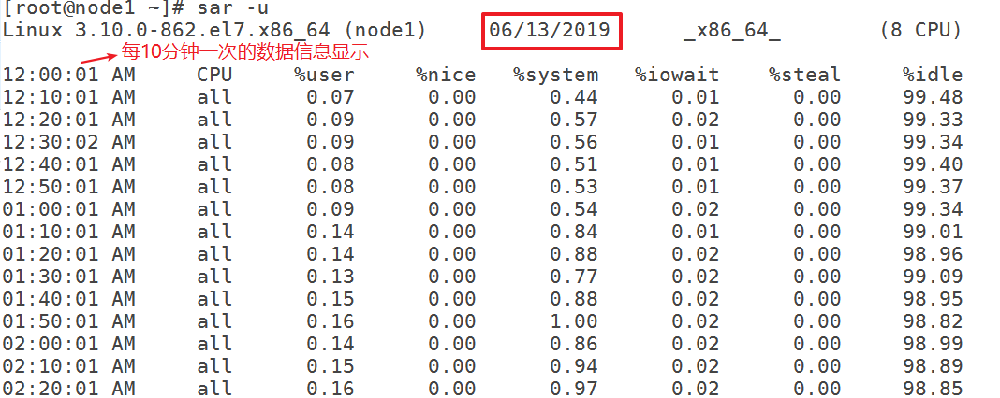
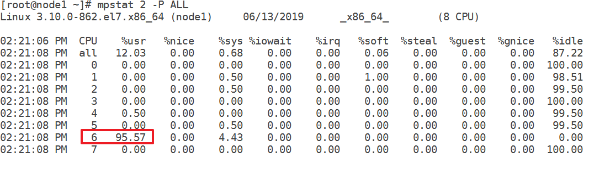
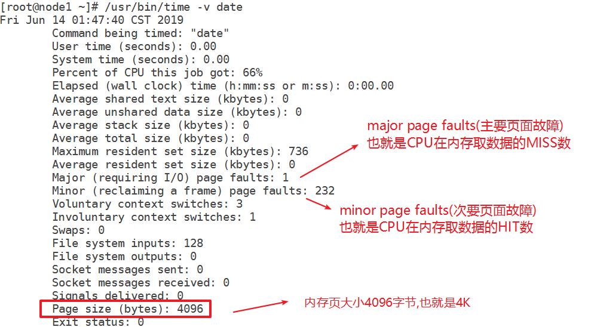
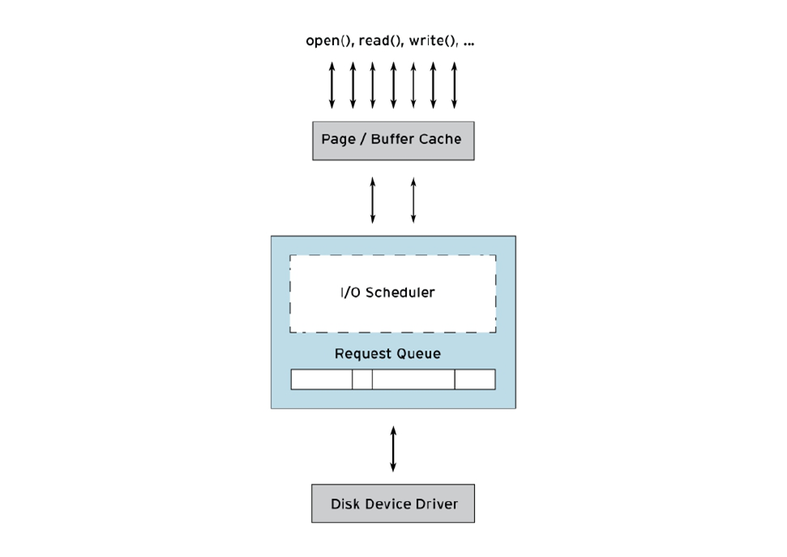
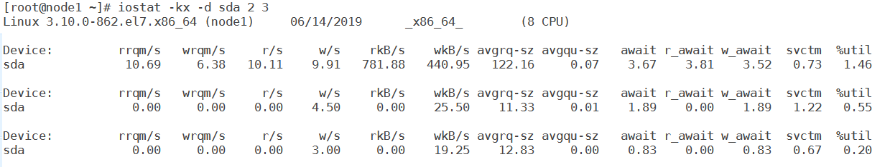

# 任务背景

做好了架构与安全, 并不代表高枕无忧了, 运维工作师还要考虑不断地**==优化(调优)==**,以提供更快地访问速度,更高的资源利用率,更好的性能等。


# 任务目标

1, 学会优化(调优)的思路

2, 灵活运用知识点与思路应对各种情况


# **学习目标**

- [ ] 能够说出调优方法分层
- [ ] 了解系统级调优cpu子系统调优方法
- [ ] 了解系统级调优mem子系统调优方法
- [ ] 了解系统级调优磁盘IO调优方法
- [ ] 了解系统级调优network调优方法
- [ ] 了解cgroup的作用
- [ ] 了解应用级调优nginx
- [ ] 能够说出内核调优方法


# 一、运维调优介绍

## **什么是调优？**

做为运维人员，调优主要是指对提供服务的服务器硬件、操作系统、应用程序等进行调节、匹配，实现整个系统的性能最大化，以满足现有业务需求。


## **调优的目的什么？**

1. 提高资源的利用率
2. 找到性能瓶颈以及缓解这个瓶颈的方法
3. 通过性能管理实现合理的资源分配
4. 提升硬件的性价比


## **调优工作的时间安排**

可从不带业务调优和带业务调优两个方面来考虑

- 应用上线前(特指服务器上线状态)
- 应用上线后


## 运维调优指导思想

1. 必须了解硬件和软件
2. 能够把所有的性能指标量化，用数字说话
3. 设置一个正常的期待值，比如将响应速度调到100ms
4. 建议具备有一定的开发能力
5. 进行更多经验积累，有一定的洞察力，才能在调节时设置准确参数


# 二、运维调优方法分层

优化的方法分层:

1. **业务级**(架构)
2. **应用级**(软件本身参数)
3. **系统级**(cpu,mem,IO,network,filesystem,内核)

以上的分层中, 效果越来越不显著。(**内核**比较特殊,没有实力最好不要调整)


调优也有**横向拓展**与**纵向拓展**的说法

- 横向拓展  为集群架构增加更多的节点,以提供更好的负载能力与高可用能力。
- 纵向拓展 增加硬件处理能力, 如增加或更换更好的cpu,mem,disk,IO等


# 三、系统级调优介绍

系统级调优分为硬件调优和kernel调优,下面重点介绍硬件调优。

硬件调优的主要对象为：

- CPU
- Memory
- Storage(IO)
- Networking

以上称为操作系统4大子系统。


# 四、CPU

## cpu概念与名词

Linux是多用户多任务操作系统, 即使是单核CPU,也一样可以跑多个程序(进程,线程)。这就像一个人一样, 可以同时做很多个事情, 但是大家也应该知道,有些事情是不能一心二用的。那么一个单核的CPU是如何处理多个程序? 答案是**==分时间片==**.


CPU是一个7X24小时的员工, 每时每刻都有工作在做(进程、线程),工作太多了就会有一张工作清单(**==运行队列==**)，由老板(**==进程调度==**)来决定他该干什么，他需要和老板沟通以便得到老板的想法并及时调整自己的工作(**==上下文切换==**)，停止一个工作转而执行另一个工作,部分工作做完以后还需要及时向老板汇报(**==中断==**)，所以CPU除了做自己该做的工作以外，还有大量时间和精力花在沟通和汇报上。


* **运行队列**:  在Linux中，一个进程要么是**运行的**，要么是**阻塞的**（正在等待某一个事件完成, 比如等待磁盘IO）。如果有多个运行中的进程, 这样就会要争用CPU了,也就需要等待CPU了,就会排队产生可运行队列。我们常说的1分钟内CPU平均**负载**就是1分钟内运行队列长度的平均值。

* **上下文切换**: 单核CPU需要在不同地进程间切换才能达到处理多任务的目的.上下文的切换开销是相当大的, 不宜过多。

* **中断:** 中断是由硬件或软件所发送的一种称为IRQ(中断请求)的信号。每个硬件设备(如:硬盘,网卡等)都需要和CPU有某种形式的通信以便CPU及时知道发生了什么事情，这样CPU可能就会放下手中的事情去处理应急事件, 硬件设备主动打扰CPU 的现象就可称为**硬件中断**。同理,软件打扰CPU的现象称为**软件中断**。

  完成一次IO操作,网络传输一次数据包都会产生中断。

* 用户态(用户空间程序): 被开发出来的应用程序,它不是操作系统的一部分的,我们被之为用户空间的程序

* 内核态(操作系统接口程序）: 所有运行在操作系统内部的程序，我们称之为内核态程序

**linux内部结构可以分为三部分，从最底层到最上层依次是：硬件-->内核空间-->用户空间**


## cpu的实时信息查看

查看cpu硬件信息的常见命令

~~~powershell
# cat /proc/cpuinfo
# lscpu
~~~

在实际调优中, 我们更需要的是采集CPU当前的实时运行数据，常见的命令有:

* top
* uptime
* vmstat
* mpstat
* sar

### vmstat

vmstat: (Virtual Memory Statistics 虚拟内存统计) 命令用来显示*Linux*系统虚拟内存状态,也可以报告关于进程,CPU,内存,I/O等系统整体运行状态。

~~~powershell
# vmstat 2  	每2秒钟采集一次数据,不间断采集
# vmstat 2 3 	每2秒钟采集一次，一共采集3次
~~~


~~~powershell
# vmstat 2 3
procs -----------memory---------- ---swap-- -----io---- -system-- ------cpu-----
 r  b   swpd   free   buff  cache   si   so    bi    bo   in   cs us sy id wa st
 2  0 533504  64212    288 155452    1    1    14    22    9   62  0  1 99  0  0
 0  0 533504  64064    288 155480    0    0     0    19  447  441  0  0 100  0  0
 0  0 533504  64096    288 155492    0    0     0    72  464  452  0  0 100  0  0
~~~


| vmstat列            | 说明                                                         |
| ------------------- | ------------------------------------------------------------ |
| r(run)              | 运行中和等待运行的进程数(运行队列长度)                       |
| b(block)            | 阻塞的进程数                                                 |
| in(interrupt)       | CPU的中断次数                                                |
| cs (context switch) | 上下文切换次数                                               |
| us(user)            | 用户进程(用户空间)消耗的CPU时间百分比                        |
| sy(system)          | 系统进程(内核空间)消耗的CPU时间百分比                        |
| id(idle)            | 空闲的CPU时间百分比                                          |
| wa(wait)            | 等待IO消耗的CPU时间百分比                                    |
| st(steal)           | 是衡量虚拟机CPU的指标，是指分配给本虚拟机的时间片被同一宿主机别的虚拟机占用，一般st值较高时，说明宿主机的资源使用可能达到瓶颈 |


### mpstat

mpstat :(Multiprocessor Statistics)，是实时系统监控工具。报告CPU的一些统计信息，这些信息存放在/proc/stat文件中. mpstat最大的特点是: **可以查看多核心cpu中每个计算核心的统计数据；而vmstat只能查看系统整体cpu情况。**


**-P 参数接数字代表查看的CPU核数, -P 接ALL代表查看所有核的信息**


| mpstat 列 | 说明                                |
| --------- | ----------------------------------- |
| nice      | 改变过优先级的进程的占用CPU的百分比 |
| irq       | 硬中断                              |
| soft      | 软中断                              |

 

### sar

sar: System Activity Reporter系统活动情况报告, 是Linux上非常全面的信息收集与分析工具，能够收集CPU,MEM,IO,NETWORK各方面的数据。它很重要的一个特性是: 不仅能实时收集数据，还能将数据保存一段时间周期供大家查看历史数据。





在/var/log/sa/目录中有两种类型文件,saxx为数据类型,需要使用`sar -f`读取, sarxx为文件类型,直接`cat`命令就可以查看

如: 下面命令指定查看12号(如果过去了则为当月12号,如果还没到则为上月12号)19点到20点的时间段信息

~~~powershell
# sar -u -f /var/log/sa/sa12  -s 19:00:00 -e 20:00:00
Linux 3.10.0-862.el7.x86_64 (vm1.cluster.com)   06/12/2019      _x86_64_        (8 CPU)

07:00:01 PM     CPU     %user     %nice   %system   %iowait    %steal     %idle
07:10:01 PM     all      0.11      0.00      0.76      0.01      0.00     99.12
07:20:01 PM     all      0.11      0.00      0.75      0.01      0.00     99.12
07:30:01 PM     all      0.11      0.00      0.71      0.01      0.00     99.17
07:40:02 PM     all      0.11      0.00      0.71      0.01      0.00     99.17
07:50:01 PM     all      0.12      0.00      0.71      0.01      0.00     99.16
Average:        all      0.11      0.00      0.73      0.01      0.00     99.15
~~~


**实验:** 执行下面的`sh /tmp/2.sh`脚本，产生一百个运算的进程(虚拟机顶不住的可以将100调小), 同时用vmstat,mpstat,sar来看cpu的变化

```powershell
[root@node1 ~]# vim /tmp/1.sh 
#!/bin/bash

a=1
sum=0
while true
do
	sum=$[$sum+$a]
	let a++	
done

[root@node1 ~]# vim /tmp/2.sh 
#!/bin/bash

for i in `seq 100`
do
	sh /tmp/1.sh &
done
```


## CPU优化思路与方法(重点)

**问题: 到底怎么样才认为需要对CPU进行优化?**

一般来说, CPU不能太闲, 也不能太忙。如果满负荷运行,满足下面的比例比较好

- User Time：65%～70%，如果高于此数值可以考虑对应用程序进行优化；
- System Time：30%～35%，高于此数值时，观察是否有过多的中断或上下文切换；
- Idle：0%～5% 

**如果CPU的Idle值非常低(非常接近0%), 运行队列也比较大(负载过高), 则说明CPU有点忙不过来了**

如果`User time`过高,则考虑用户空间程序(也就是本服务器跑的应用程序,如nginx,php,tomcat,mysql等)是否有优化的空间

如果`System Time`过高

* %iowait 高，这时要重点关注磁盘IO的相关操作，是否存在不合理的文件写操作,日志写操作,数据库写操作等；

* %soft或%cs高，网卡流量是否较大,可不可以精简数据,代码在是否在多线程操作上存在不合适的中断操作等

* %steal 高，这种情况一般发生在有虚拟化的, 这时要查看宿主机是否资源超限； 

如果一切都是正常的, 但就是CPU忙不过来,成为了瓶颈。这个时候我们就需要优化了。


**问题: 怎么优化?**

* 横向拓展  看是否将应用的一部分负载转移到其它服务器(LB,分表分库,读写分离等)
* 纵向拓展  换更好的CPU(课后了解SMP,NUMA,MPP)
* 微调         


微调的方法主要包括:

* 进程优先级调整 将重要的进程优先级调高, 以占用更多的CPU资源
* cpu亲和性(affinity)   也叫绑核,亲缘性, 姻亲等。


### 进程优先级

优先级高的进程能够优先分配资源，跑得快，花费的时间少(高负载的情况下，效果更明显)

进程优先级能调的范围是 -20到19, -20表示优先级最高,19最低(默认优先级为0)

主要命令有两个:

* nice		  对进程设置优先级并运行
* renice       对一个正在运行的进程重新改优先级

**实例:**

准备一个脚本  

~~~powershell
[root@node1 ~]# vim /tmp/test.sh 

a=1

while [ $a -lt 1000000 ]
do
        let a++
done
~~~

第一个终端:

~~~powershell
[root@node1 ~]# time sh /tmp/test.sh 

real    0m39.363s
user    0m26.338s
sys     0m0.900s
~~~

第二个终端：

~~~powershell
[root@node1 ~]# time nice --19 sh /tmp/test.sh	--19 		第一个是参数的横杠，第二个是负号

real    0m26.881s
user    0m26.008s
sys     0m0.871s
~~~

> 对比上面的时间，可以看到高优先级的花费的时间少(机器负载越高,效果越明显)

可以把上面的实验再做一次，马上用top查出-19的pid值，并使用renice修改

~~~powershell
# renice 19 PID
~~~

~~~powershell
[root@node1 ~]# time sh /tmp/test.sh 
real    0m34.665s
user    0m26.277s
sys     0m0.896s

[root@node1 ~]# time nice --19 sh /tmp/test.sh
real    0m37.231s
user    0m26.094s
sys     0m0.905s
~~~

> 从上面的时间可以看出，-19优先级的半路被改为19后，所花费的时间反而多了
>

**注意：只有管理员才能把优先级往高调，普通用户只能调自己的，并且只能往低调，调低后还不能再调高**


### cpu亲和性

taskset命令可以将**进程绑核**,格式为`taskset -p -c cpu-list pid`，其中cpu-list是数字化的cpu列表，从0开始。多个不连续的cpu可用逗号连接，连续的可用`-`连接，比如0,2,5-11等。

**例:** 

```powershell
[root@node1 ~]# taskset -c 6 sh /tmp/1.sh &
[1] 25528

[root@node1 ~]# ps -eo psr,command,pid |grep 1.sh |grep -v grep
  6 sh /tmp/1.sh                  25528
可以看到这个程序的运行被指定到编号为6的核上去了
```



~~~powershell
[root@node1 ~]# taskset -p -c 5 25528
pid 25528's current affinity list: 1-3
pid 25528's new affinity list: 5

[root@node1 ~]# ps -eo psr,command,pid |grep 1.sh|grep -v grep
  5 sh /tmp/1.sh                  25528
以看到这个程序的运行被指定到编号为5的核上去了
~~~


**定义中断亲和性**


从上图中可以看到ens33网卡的中断都在cpu0上,我们如果想要将ens33网卡的中断给绑到cpu1上,也就是第2张网卡, 那么可以做下面的命令

~~~powershell
注意19为上图中第1列对应的IRQ信号
# echo 2 > /proc/irq/19/smp_affinity	

改完后,多次使用下面命令,就可以看到ens33网卡在cpu0上的中断数不变,在cpu1上的中断数不断增大了
# cat /proc/interrupts  |grep ens33
  19:    3044557   124    0     0     0     0    0    0   IO-APIC-fasteoi   ens33
# cat /proc/interrupts  |grep ens33
  19:    3044557   150    0     0     0     0    0    0   IO-APIC-fasteoi   ens33
# cat /proc/interrupts  |grep ens33
  19:    3044557   181    0     0     0     0    0    0   IO-APIC-fasteoi   ens33  
~~~


小结:

cpu优化:

* 概念与名词(**时间片,运行队列, 进程调度, 上下文切换, 中断,用户空间,内核空间**等)
* top,**vmstat,mpstat,sar**都可以用来查看cpu状态
* 优化的方法: 横向拓展(业务级),纵向拓展(课后上网查询:SMP,NUMA,MPP), 微调(**进程优先级**与**cpu亲和性**)


# 五、内存

## 内存概念与名词

因为CPU的速度相对于DISK来说太快了,CPU做运算需要从DISK里拿数据, 这样会造成CPU会经常等待DISK。所以我们需要有一个既能存放数据又速度快的存储器帮助CPU与DISK沟通----内存。

**内存的作用:** **内存是连接CPU和其他设备(DISK)的通道，起到缓冲和数据交换作用。**

**内存的特点:** **存储数据速度快, 但是数据不是永久存放的, 断电则可能数据丢失。**


1, CPU做运算需要取数据, 会先从内存里查找是否有需要的数据。

* 如果内存里能查到则为HIT命中, 那么就直接从内存里取数据(上图中【2】步骤)
* 如果内存里查不到则为MISS(未命中), 那么就先从硬盘取数据到内存(cache中)，再给CPU(上图中【1】【2】步骤)

2, CPU运算完后,需要将结果再存放回硬盘(需要永久存放)。

* 这种运算修改后的数据我们称为dirty data脏数据, 会先给内存(存到buffer中)。   (上图中【3】步骤)
* 内存中的脏数据达到一定的比率(此比率在后面可以通过内核参数优化调整)后会给硬盘。(上图中【4】步骤)


内存使用LRU(least recent used)算法,当内存满了,新的数据进来,会把**最近最少使用**的数据丢掉。


内存包括**物理内存**和**虚拟内存(swap)**

- 增加虚拟内存swap的目的是为了增强物理内存的性能, 但是过多的使用swap也不一定好。
- 物理内存不够用时,会用到虚拟内存swap(**==注意: 不是绝对的, 不要用free命令看到有使用过swap就认为内存不够了==**)

~~~powershell
[root@node1 ~]# free
              total        used        free      shared  buff/cache   available
Mem:         997980      773616       69400        4704      154964       44112
Swap:       2047996      633924     1414072
~~~

| free命令的列            | 说明                           |
| ----------------------- | ------------------------------ |
| total                   | 物理内存总量                   |
| used                    | 内存使用量(包括buffer与cache)  |
| free                    | 未分配使用的内存量             |
| shared                  | 共享内存                       |
| buffer                  | 块设备缓存                     |
| cache                   | 文件缓存                       |
| **available**(重点关注) | **可用于给新进程的内存可用量** |

> 共享内存允许两个或多个进程访问同一块内存区域，这样的进程通讯方式效率高(了解即可)。
>
> buffer与cache都为缓存区,CPU从内存里取数据HIT命中就是在cache中找数据，CPU运算后的脏数据从buffer写回到磁盘。
>
> buffer: A buffer is something that has yet to be "written" to disk.（内存 -> 磁盘）
>
> cache: A cache is something that has been "read" from the disk and stored for later use. （磁盘 -> 内存)


**内存管理的单位为页(page),在linux里默认为4K大小**

通过time命令加-v参数(**time命令需要写绝对路径**)接一个命令或程序(我这里使用简单的date命令),可快主显示出内存的相关信息




~~~powershell
# getconf PAGESIZE
4096								内存页大小
~~~


小实验:

~~~powershell
# echo 3 > /proc/sys/vm/drop_caches        清除内存里的cache

# /usr/bin/time -v firefix     
在清除cache后第1次执行此命令和第2次执行,计算打开的时间来体会内存cache的作用
~~~


## 内存的实时信息查看

vmstat命令可以查看内存相关信息, 这里的swapd,free,buff,cache都与free命令有对应的列。但有两个列是free命令里查看不到的.

* si  实时查看到的从虚拟内存swap到物理内存的值
* so 实时查看到的从物理内存到虚拟内存swap的值

所以si,so代表了物理内存与虚拟内存swap之间的交互繁忙程度。交互越繁忙,越能说明内存产生了瓶颈。

~~~powershell
# vmstat 2 3
procs -----------memory---------- ---swap-- -----io---- -system-- ------cpu-----
 r  b   swpd   free   buff  cache   si   so    bi    bo   in   cs us sy id wa st
 1  0 633924  68144      0 156752    2    2    50    29   37   25  0  1 99  0  0
 0  0 633924  67936      0 156780    0    0     0    14  348  299  0  0 99  0  0
 0  0 633924  67596      0 157056    0    0     0   145  450  378  0  1 99  0  0
~~~


使用`sar -B`命令可以得到内存的相关信息


主要看前面4列:

| 列名      | 说明                                                         |
| --------- | ------------------------------------------------------------ |
| pgpgin/s  | 每秒从磁盘到内存的数据,单位为KB.(CPU在内存取不到数据,就要从磁盘取到内存中的cache) |
| pgpgout/s | 每秒从内存到磁盘的数据,单位为KB (脏数据积累到buffer区域一定比率后会写到磁盘) |
| fault/s   | 每秒的(major+minor)的page faults之和,也就是cpu从内存取数据的hit+miss次数之和 |
| majflt/s  | 每秒的major page faults数, 也就是cpu从内存取数据的miss次数   |


**问题: 到底怎么样才说明内存不够?**

建议结合free,vmstat,sar命令综合分析

如果满足以下条件,则说明内存出现了瓶颈

* `free`命令看到的`available`值很小
* `vmstat`命令看到的`si,so`较多
* `sar -B`命令通过`fault/s`和`majflt/s`，算出命中率不高

总之要多观察,多维度来证实是否真的是内存不够。


## 内存优化思路与方法

如果内存真的出现了瓶颈,那么最好的优化方法仍然是

- 横向拓展  看是否将应用的一部分负载转移到其它服务器(LB,分表分库,读写分离等)
- 纵向拓展  换更好的内存,加更大的内存 
- 微调         

内存能微调的地方主要就是: 修改内核参数

## 内核参数修改

对于运维工程师来说,修改操作系统的**内核参数**就能达到优化操作系统的目的。


### **查看内核参数**

~~~powershell
# sysctl -a
在centos7中有1000多个内核参数

# sysctl -a |grep ip_forward	
net.ipv4.ip_forward = 1
这个参数对应的/proc路径为/proc/sys/net/ipv4/ip_forward
~~~

### **修改内核参数的方法**

* 临时修改(立即生效,重启后失效)

~~~powershell
方法1: 
# echo 1 > /proc/sys/net/ipv4/ip_forward

方法2:
# sysctl -w net.ipv4.ip_forward=1
~~~

* 永久生效

在`/etc/sysctl.conf`配置文件里加上要修改的内核参数与值

~~~powershell
net.ipv4.ip_forward = 1
~~~

修改保存后，记得要用`sysctl -p`使之生效

### 与内存优化有关的内核参数

~~~powershell
[root@node1 ~]# cat /proc/sys/vm/swappiness
30
~~~

swappiness表示使用swap分区的使用程度, 可以适当调整.

swappiness趋向于0表示尽可能使用物理内存空间.

swappiness趋向于100表示积极使用swap.

基本调优规则为: 如果物理内存够大，那么就尽量不要使用swap,以提高性能.可以把此参数调小如swappiness=10.


~~~powershell
[root@node1 ~]# sysctl -a |grep min_free
vm.min_free_kbytes = 45056
~~~

内存最小的free预留值。调太大,会造成可用内存减小。调太小,可能会造成系统急用内存时没有足够的预留。不建议调整它。


~~~powershell
[root@node1 ~]# cat /proc/sys/vm/dirty_background_ratio
10
[root@node1 ~]# cat /proc/sys/vm/dirty_ratio
30

~~~

这两个参数合起来理解就是:

内存脏数据到`dirty_background_ratio定义`的10％时,就会触发数据写到磁盘（但是这个过程是异步的，也就是说还是会有别的应用程序的脏数据能继续写到内存), 如果应用程序往内存里写的比内存往磁盘里写得快，还是有可能达到`dirty_ratio`定义的30%时，那么就要让写脏数据的应用程序等待，直到它降低到30％以下, 再继续写。


理解了上面两个参数的意思,再来看优化思路:

1, dirty_background_ratio

将值调大的优点:

* 提高写入磁盘效率(因为一次写的数据量大,写的次数少)

将值调大的缺点:

* 有可能一次写的数据量过大，造成磁盘IO峰值


2, dirty_ratio

在应用程序写内存繁忙时，可以把dirty_ratio值调大，可以缓解应用程序的等待。但是调太大可能会造成内存中过量的脏数据。


**场景1:** 如果有很快速的磁盘IO,并且磁盘有高可用(比如raid,分布式存储等), 那么可以减少缓存,让其尽量快的写到磁盘上，也能提高突然断电数据丢失的概率(操作系统没有不间断电源的情况)。

~~~powershell
vm.dirty_background_ratio = 5
vm.dirty_ratio = 10
~~~

**场景2:** 如果磁盘IO不算快但也不能忙, 内存也够大, 不考虑断电数据丢失的情况下(比如有ups的情况)希望提高性能。

~~~powershell
vm.dirty_background_ratio = 30
vm.dirty_ratio = 60
~~~

**场景3:** 高并发情况下,磁盘IO快,但很繁忙。在内存空间还允许的情况下,可以尝试以下调整:

~~~powershell
vm.dirty_background_ratio = 5
vm.dirty_ratio = 60
~~~


#  六、磁盘IO

IO: (input and ouput) 输出输入

IO子系统是速度最慢的，所以容易成为整个系统的性能瓶颈。




## IO的实时信息查看

vmstat命令可以查看简单的io实时信息

~~~powershell
[root@node1 ~]# vmstat 2 3
procs -----------memory---------- ---swap-- -----io---- -system-- ------cpu-----
 r  b   swpd   free   buff  cache   si   so    bi    bo   in   cs us sy id wa st
 1  0 720488  62052      0 124860    7    5   114    57   20    7  0  1 99  0  0
 1  0 720232  69588      0 125788   12    0 12544   140  676  440  0  1 99  0  0
 1  0 720232  69900      0 126060    0    0    30    26  314  293  0  0 100  0  0
~~~

| 列   | 说明                                                         |
| ---- | ------------------------------------------------------------ |
| bi   | Blocks received from a block device (blocks/s)       每秒读出的block数 |
| bo   | Blocks sent to a block device (blocks/s)                   每秒写入的block数 |

vmstat中的bi和bo两列查看到的信息不够全面。用`iostat`命令查看更详细更多的IO实时信息.

~~~powershell
[root@node1 ~]# iostat
Linux 3.10.0-862.el7.x86_64 (node1)     06/14/2019      _x86_64_        (8 CPU)

avg-cpu:  %user   %nice %system %iowait  %steal   %idle
           0.18    0.00    0.81    0.07    0.00   98.94

Device:            tps    kB_read/s    kB_wrtn/s    kB_read    kB_wrtn
sda              19.92       777.30       439.78  163530826   92522175
sdb               2.20       124.90         8.19   26276048    1722212
scd0              0.00         0.00         0.00       1028          0
dm-0              2.29       124.84         8.14   26263452    1711744
~~~

| 列        | 说明                                                         |
| --------- | ------------------------------------------------------------ |
| tps       | 每秒的IO请求次数                                             |
| kB_read/s | 每秒读了多少个block(一个block单位为512bytes)                 |
| kB_wrtn/s | 每秒写了多少个block                                          |
| kB_read   | 两次查看的时间间隔内，一共**读**了多少块(Blk_read/s乘以两次查看时间间隔秒数); 如果只看一次，是表示从开机到现在**读**的总量 |
| kB_wrtn   | 两次查看的时间间隔内，一共**写**了多少块（Blk_wrtn/s乘以两次查看时间间隔秒数）,如果只看一次，是表示从开机到现在**写**的总量 |

~~~powershell
# iostat 2 	--每两秒显示所有的分区IO状态
# iostat /dev/sda*  2  --每两秒显示所有分区的io状态 
~~~


使用`iostat -kx`能查看更详细的信息




| 列       | 说明                                                         |
| -------- | ------------------------------------------------------------ |
| avgrq-sz | 平均请求数据的大小                                           |
| avgqu-sz | 是平均请求队列的长度。队列长度越短越好。                     |
| await    | 平均每次设备I/O需要等待多少时间, 包含服务时间，还有在队列中等待的时间(毫秒) |
| r_await  | centos7里多了这一列，表示读请求的await                       |
| w_await  | centos7里多了这一列，表示写请求的await                       |
| svctm    | 平均每次设备I/O操作的服务时间 (毫秒)                         |
| %util    | 磁盘带宽使用百分比(在统计时间内所有处理IO时间，除以总共统计时间). 如果一直都是100％，说明磁盘很忙。 |


`sar -b`命令也可以查看IO实时信息与历史信息

~~~powershell
[root@node1 ~]# sar -b
Linux 3.10.0-862.el7.x86_64 (node1)     06/15/2019      _x86_64_        (8 CPU)

12:00:02 AM       tps      rtps      wtps   bread/s   bwrtn/s
12:10:01 AM     35.86     18.65     17.21   3063.17   1586.89
12:20:01 AM     52.60     27.34     25.26   4242.01   1815.45
12:30:02 AM     50.99     29.99     21.00   4360.30   1956.12
......
~~~


**问题: 如何判断磁盘IO成为了瓶颈?**

如果%util一直在100%的状态,await等待时间长,`avgqu-sz`请求队列长。这些都能说明磁盘IO满负荷了,该磁盘可能存在瓶颈.


**如何优化来解决瓶颈?**

* 换更好更快的硬盘,专业的存储设备与专业的存储卡(硬件范畴在这里不讨论)
* raid(raid5,raid10等)
* lvm(条带卷)
* 分布式存储
* IO调度算法
* 合适的文件系统


## IO调度算法

当磁盘有大量的IO请求时,内核是需要有相应的算法去处理,这就是IO调度算法。

centos7的3.10版本内核有三种IO调度算法:

* **noop** (No Operation)
* **deadline** (**截止时间调度程序**)
* **cfq** （Completely Fair Queuing, 完全公平队列）


noop:  大致按照IO请求的**时间**顺序来处理，先来先处理。响应快,CPU不用费时,低开销.

cfq: 按照IO请求的**地址**进行排序，而不是按照先来后到的顺序来进行响应。这样的话磁盘读写效率高(节省机械硬盘的磁盘寻道时间)，但有可能会造成先请求的IO因为地址太远，而出来等待太久的情况(术语称为饿死).

deadline: 在cfq的基础上加了IO队列来维护等待的IO。如果IO等待过长，超过特定值，会优先处理。


**从原理上分析的结果:**

cfq算法出发点是对IO地址进行排序, 以尽量少的磁盘旋转次数来满足尽可能多的IO请求。在CFQ算法下,SAS机械硬盘的吞吐量大大提高了. 但是相比于NOOP的缺点是，先来的IO请求并不一定能被满足，可能会出现饿死的情况。

随机IO:

顺序IO:


deadline算法防止了地址远而会被饿死的情况出现, 非常适合业务比较单一并且IO压力比较重的业务, 比如数据库


noop算法适合SSD固态硬盘, 因为其他算法的优化是基于缩短寻道时间的，而固态硬盘没有所谓的寻道时间且IO响应时间非常短. 对于固态硬盘来说, IO调度算法越复杂, 效率就越低, 因为额外要处理的逻辑越多。


固态硬盘建议使用noop

机械硬盘且顺序IO多，建议使用cfg

机械硬盘且随机IO多，建议使用deadline


**查看当前sda磁盘默认的调度算法**

~~~powershell
[root@node1 ~]# cat /sys/block/sda/queue/scheduler
noop [deadline] cfq
~~~

**修改调度算法**

~~~powershell
[root@node1 ~]# echo noop > /sys/block/sda/queue/scheduler

[root@node1 ~]# cat /sys/block/sda/queue/scheduler
[noop] deadline cfq
如果要永久修改,可考虑将修改的命令加到/etc/rc.local里
~~~


# 七、NETWORK

网络的监测是所有Linux子系统里面最复杂的, 有太多的因素在里面。比如: 延迟,阻塞,冲突,丢包等。更复杂的是与网络协议相关的调整。


## 网络排查思路

==**注意:** 有些测试请用物理机器测试效果最好(虚拟机测试网速之类的效果都会不对,因为虚拟机最终使用的是物理网卡)==

首先,如果网络不通或者网络时通时不通, 再或者网络很慢, 如何去查看去排查?

1, 检查网卡是否连接OK

~~~powershell
# mii-tool ens33	
ens33: negotiated 100baseTx-FD, link ok	
看到link ok，说明网线连接正常，但并不代表网线完全正常（可能水晶头松了或信号线接触不良等）
~~~

2, 检查网卡的工作模式和修改

~~~powershell
# ethtool ens33
Settings for ens33:
        Supported ports: [ TP ]
        Supported link modes:   10baseT/Half 10baseT/Full
                                100baseT/Half 100baseT/Full
                                1000baseT/Full
        Supported pause frame use: No
        Supports auto-negotiation: Yes
        Supported FEC modes: Not reported
        Advertised link modes:  10baseT/Half 10baseT/Full
                                100baseT/Half 100baseT/Full
                                1000baseT/Full
        Advertised pause frame use: No
        Advertised auto-negotiation: Yes
        Advertised FEC modes: Not reported
        Speed: 1000Mb/s					   这里可以看速率,如果速率不对,就要注意一下
        Duplex: Full
        Port: Twisted Pair
        PHYAD: 0
        Transceiver: internal
        Auto-negotiation: on
        MDI-X: off (auto)
        Supports Wake-on: d
        Wake-on: d
        Current message level: 0x00000007 (7)
                               drv probe link
        Link detected: yes
~~~


~~~powershell
# ethtool -s ens33 speed 10 duplex half autoneg off
把网卡改成10M/s的速率，半双工，关闭自动协商

# ethtool -s ens33 speed 1000 duplex full autoneg on	
把网卡改成1000M/s的速率，全双工，打开自动协商
~~~


3, 用`arp-scan`这类小工具扫描内网机器, 查看是否有IP冲突的机器

```powershell
# yum install arp-scan    		
需要epel源

# arp-scan -l --interface ens33	
查看局域网内所有机器的IP和MAC地址的对应

# arp -a -n
查看所有和本机联系过并且仍然保存在arp缓存列表里的机器的IP和MAC地址的对应 

# ip neigh   
类似arp -a -n
```

**arp冲突小实验:**

三台机器,一台为10.1.1.11,另两台IP相同(比如:10.1.1.12)

~~~powershell
在10.1.1.11上重复下面的步骤,并观察,会发现10.1.1.12的MAC可能不一样的
# ping 10.1.1.12
# arp -a -n |grep 10.1.1.12   
# arp -d 10.1.1.12
~~~


4, 检测网卡的当前负载

~~~powershell
# sar -n DEV 2 

02:09:37 PM     IFACE   rxpck/s   txpck/s    rxkB/s    txkB/s   rxcmp/s   txcmp/s  rxmcst/s
02:09:39 PM        lo      0.00      0.00      0.00      0.00      0.00      0.00      0.00
02:09:39 PM      eth0    659.69    255.10     40.16    344.18      0.00      0.00      0.00
02:09:39 PM       br0    659.69    255.10     31.14    344.18      0.00      0.00      2.55
02:09:39 PM    vmnet1      0.00      0.00      0.00      0.00      0.00      0.00      0.00
02:09:39 PM    vmnet2      0.00      0.00      0.00      0.00      0.00      0.00      0.00
02:09:39 PM    virbr0      0.00      0.00      0.00      0.00      0.00      0.00      0.00
02:09:39 PM virbr0-nic      0.00      0.00      0.00      0.00      0.00      0.00      0.00


rxpck/s   每秒收到的数据包数
txpck/s	  每秒发送的数据包数
rxpck/s	  每秒收到的kb
txpck/s	  每秒发送的kb
~~~

5, iptraf工具可以查看本机网络吞吐量,速率等，支持文字图形界面，很直观。

~~~powershell
	# yum install iptraf-ng 	本地镜像yum源

	# iptraf-ng					直接打开，选择你要查看统计数据
	# iptraf-ng -d eth0			直接看eth0的统计数据
~~~

6, netperf 运行在 client/server 模式下，比iptraf能更多样化的测试终端的吞吐量。

 测试方法：服务器和客户端都要安装此软件

在服务器上

```powershell
# netserver 
Starting netserver with host 'IN(6)ADDR_ANY' port '12865' and family AF_UNSPEC

# netstat -ntlup |grep 12865	--端口为12865
tcp        0      0 :::12865                    :::*                        LISTEN      18366/netserver     
```

在客户端上

~~~powershell
# netperf -H 10.1.1.8 -l 30	   			
接服务端IP,一次测试时间为30秒

MIGRATED TCP STREAM TEST from 0.0.0.0 (0.0.0.0) port 0 AF_INET to 10.1.1.8 (10.1.1.8) port 0 AF_INET
# netperf -H 10.1.1.8 -l 30

Recv   Send    Send                          
Socket Socket  Message  Elapsed              
Size   Size    Size     Time     Throughput  
bytes  bytes   bytes    secs.    10^6bits/sec  

 87380  16384  16384    30.39      87.39   --这里的87.39的单位是10^6bits，所以要算每秒多少MB就应该$[87*1000000/8/1024/1024]算得多少MB/s大概为10M多/s(因为百M局域网理论值为12.5MB/s)
~~~


网络优化的思路:

如果CPU,mem,IO都没问题,然后网络连接,模式,没有IP冲突,流量大但都是正常流量(没有被攻击),怎么优化?

* 业务级
* 加带宽
* 微调


## 网络TCP连接过程


### 三次握手

知识点: SYN(同步序列号:synchronous), ACK(确认号:acknowledgement), syn_flood攻击;
相关状态: LISTEN, SYN_SENT, SYN_RCVD

**问题1:** tcp为可靠的传输协议,什么叫可靠传输?

~~~powershell
可靠传输要保证数据包必须传给对方,对方没收到会自动重发.
~~~


**问题2:** 如何保证可靠传输?

~~~powershell
需要通信双方能够判断自己发送的数据是否被对方成功接收.这就引出了SYN和ACK的概念了
~~~


**问题3:** SYN与ACK如何工作?

~~~powershell
SYN是一个随机序列号,ACK是在此序列号基础上加上成功收到的字节数

如:张三发了100个字节给李四,附带产生一个SYN(随机为123);
   李四成功收到后会回给张三一个ACK（123+100=223）
   这样张三就知道成功的发送了100个字节给李四
~~~


**问题4:** 为什么三次握手时, 发送方产生SYN,而接收方回的是SYN+1

~~~powershell
因为TCP的设计者将SYN这个同步标志位SYN设计成占用1个字节的编号
~~~


**问题5:** 为什么要三次握手, 而不是二次握手或四次握手?

~~~powershell
TCP是双向通讯协议
客户端需要第二个报文来确认服务端真实存在且数据通道是双向的
服务端需要第三个报文来确认客户端真实存在且数据通道是双向的

二次握手达不到目的,四次多余.
~~~


**问题6:** 什么是syn_flood攻击?

SYN_Flood (SYN洪水) 是一种典型的DDos攻击(分布式拒绝服务攻击distributed deny of service) 攻击方法.

攻击方可以控制多台肉鸡向服务器发送大量SYN消息但不响应ACK消息, 或者干脆伪造SYN中的Source IP,使服务器响应的SYN-ACK消息石沉大海，导致服务器被大量注定不能完成的半开连接占据，直到资源耗尽，停止响应正常的连接请求.


**syn_flood的基本诊断:** 

* 服务器突然连接不够用了,大量客户反映无法连接服务器
* 服务器相比平常多出大量的SYN_RCVD状态的连接

~~~powershell
# ss -s
用此命令查出有大量的timewait和synrecv

# netstat -n |grep ^tcp |awk '{print $NF}' |sort |uniq -c |awk BEGIN'{print "状态\t\t连接数"} {print $2"\t"$1}'	 
查出有大量的SYN_RCVD状态
~~~

**应急处理:** 

可以考虑写shell脚本使用iptables将攻击嫌疑IP给禁止，过一段时间再解禁。但这种做法容易把正常客户给禁掉，只用于应急处理

~~~powershell
比如:写一个类似我下面的脚本
#!/bin/bash

touch /tmp/denyiplist.txt

netstat -nt |awk '$NF~"SYN_RECV" {print $0}' | grep :80 |awk -F: '{print $8}' |sort |uniq -c |awk '$1>10 {print $2}' |while read ip
do
        grep $ip /tmp/denyiplist.txt &> /dev/null
        if [ $? -ne 0 ];then
        iptables -A INPUT -p tcp --dport 80 -s $ip -j REJECT
        echo "$ip" >> /tmp/denyiplist.txt
at now + 1 days << EOF
iptables -D INPUT -p tcp --dport 80 -s $ip -j REJECT
sed -i "/$ip/"d /tmp/denyiplist.txt
EOF
        fi
done
~~~

**调整内核参数做微调(syn_flood相关)**

服务器遭受攻击时回应SYN+ACK,如果客户端不回应第3次握手,它会重传数据包默认重试次数为5次，重试的间隔时间从1s开始每次都翻倍，分别为1s + 2s + 4s + 8s +16s = 31s, 第5次发出后还要等32s才知道第5次也超时了,所以一共是31 + 32 = 63s。

~~~powershell
net.ipv4.tcp_synack_retries = 1   
默认为5,改小(1-2),极端就暂时改为0,表示减小服务器回应syn+ack包的重试次数。
此值过小也会带来风险:正常的SYN因网络原因丢失,不重试的话会造成真正的客户连接无法成功
~~~

大量的攻击造成很多连接都无法成功到established状态,这些半连接会存放到一个队列里

~~~powershell
net.ipv4.tcp_max_syn_backlog = 4096	
可以适当调大,此参数表示服务器维护的半连接的队列长度,加大此值,可以支持更多的半连接.
但同时也要注意,此值太大也会消耗服务器资源
~~~

服务器会用特定的sequence number(syncookie)发送给客户端,真实的客户端会返回一个ack为cookie+1;而伪造的客户端，将不会作出响应。这样我们就可以知道那些IP对应的客户端是真实的

~~~powershell
net.ipv4.tcp_syncookies = 1 	
改此值为1后,tcp会使用一种特殊的cookies的方法来处理连接.(防syn_flood有一定效果，但是高负载并且没有受到syn_flood攻击，建议关闭)
~~~


### 数据传输

知识点: 长连接与短连接, 超时重传，快速重传，流量控制，拥塞控制(慢启动,拥塞避免,拥塞发生,快速恢复);
相关状态: ESTABLISHED

**TCP的长连接与短连接**

三次握手之后, 可以进行数据传输了. 但这里有一个问题,传数据不是一次性传完的,可能分多次,那么难道我每次传输前都要三次握手,传完断开吗? 这么做就属于短连接, 多次传输的话性能不好。

所以我们可以使用长连接,一次连接多次传输,以提高效率.

但长连接也有要考虑的问题: 如果连接不断开,而很长没有新的数据传输了,这个连接又占用资源了。所以需要隔一定的时间会自动断开,但这个时间默认比较长,所以可以适当优化。

~~~powershell
net.ipv4.tcp_keepalive_time = 1800
默认为7200秒（两小时)，server在7200秒没有收到客户端数据传输，会发送探测包确认它是否alive.
可适当调小，如调成1800秒
~~~

~~~powershell
net.ipv4.tcp_keepalive_probes = 3     
默认9次，表示server需要9次探测client是否alive，9次都没回应，就断开这个tcp连接。可以适当调小
~~~

~~~powershell
net.ipv4.tcp_keepalive_intvl = 20	
75秒，表示server探测的时间间隔。适当调小
~~~

小结: 

长连接多用于数据传输频繁，而且连接数不能太多的情况。例如: 数据库的连接.

短连接多用于并发数大,但数据传输不很频繁的场景。像高并发的web服务器不好用长连接,因为连接资源很宝贵。

(http1.0只支持短连接,httpd1.1可以使用keep alive等参数实现带时间,操作次数限制的长连接)


~~~powershell
超时重传
快速重传
流量控制
拥塞控制(慢启动,拥塞避免,拥塞发生,快速恢复)
net.ipv4.tcp_fack = 1
net.ipv4.tcp_sack = 1
net.ipv4.tcp_dsack = 1
net.ipv4.tcp_window_scaling = 1
~~~


### 四次挥手


**相关状态:** 
FIN_WAIT_1;CLOSE_WAIT,FIN_WAIT_2;LAST_ACK;TIME_WAIT;CLOSING;CLOSED

参考: http://dy.163.com/v2/article/detail/EENRSF0705315U6Q.html

**问题1:** 为什么要四次挥手,而不是三次?

~~~powershell
由于TCP连接是全双工的,所以每个方向都必须要单独进行关闭
客户端要断开,服务器可能还没准备好(数据还未全部到达服务器),所以服务发送FIN来断开，只能先回一个ACK同意客户端的断开
~~~

**问题2:** 为什么TIME_WAIT等待时间比较长?

~~~powershell
因为TIME_WAIT状态要等待2个MSL(Maximum Segment Lifetime)时间

MSL是网络上报文的存活的最长时间，超过这个时间报文将被丢弃
~~~

**问题3:** 为什么要等待2个MSL才关闭?

~~~powershell
为了保证客户端最后一次挥手的报文能够到达服务器

如果第四次挥手的报文段丢失了,服务器会超时重传第三次挥手的报文段
如果客户端不是保持TIME_WAIT,而是已经进入closed,那么重传第3次报文就没意义了
~~~

**问题4:** 如果服务器有大量的time_wait状态,会有什么影响?

~~~powershell
服务器(相对来说是客户端的身份)的连接数是有限制的,每一个连接都需要消耗1个端口。
在高并发的环境下,大量的连接因为在等待2个MSL,而造成端口资源不够用
~~~

可以做如下相关的优化:

~~~powershell
net.ipv4.ip_local_port_range = 1024  65535 tcp对外连接分配的端口号范围，可以把随机端口全部分配给它

net.ipv4.tcp_timestamps  = 1    默认为1，不用调，主要是配合下面的tw_reuse和rw_recycle使用的(打开tw_reuse和rw_recycle必须要打开这个参数)
net.ipv4.tcp_tw_reuse  = 1  	默认为0，改为1表示打开time_wait状态连接的快速重用（针对client)
net.ipv4.tcp_tw_recycle	= 1   	默认为0，改为1表示打开time_wait状态连接的快速回收(针对server)

net.ipv4.tcp_max_tw_buckets = 40960   服务能维护的最大time_wait数量，在内存足够可以再适当调大
net.ipv4.tcp_fin_timeout = 30  		  默认为60,表示FIN－WAIT-2状态的时间，适当调小
~~~

**问题5:** 既然可以使用快速回收和重用的方法来快速closed连接,那会不会造成不好的影响呢?

~~~powershell
如果Client直接closed，然后又再向Server发起一个新连接,有可能新连接和老连接的端口号是相同的.

假设新连接和已经关闭的老连接端口号是一样的,如果前一次连接的某些数据仍然滞留在网络中,
TCP协议就认为那个延迟的数据是属于新连接的，这样就和真正的新连接的数据包发生混淆了.

所以TCP连接还要在TIME_WAIT状态等待2倍MSL，这样可以保证本次连接的所有数据都从网络中消失
~~~

~~~powershell
如果是LVS NAT架构,因为对于后端的的realserver来说,不同的client经由lvs连接realserver
realserver会和lvs调度器建立很多连接(大部分是不同客户端),如果net.ipv4.tcp_tw_recycle=1会产生大量上面讨论的问题.
~~~


# 八、资源限制

有时候资源闲置也是一种浪费,更加合理高效的利用资源也属于优化。

后面要学习的虚拟机与容器等技术其中之一的优点就是资源的最大化利用,就需要用到**资源限制**。


## CGroups资源限制

Cgroups是control groups的缩写，是Linux内核提供的一种可以限制、记录、隔离进程组（process groups）所使用的物理资源（如：cpu,memory,IO等等）的机制.


作用：

1、资源隔离

2、基于进程的资源限制

3、共有9大子系统

* blkio       限制每个块设备的输入输出控制。例如:磁盘,光盘以及usb
* cpu         限制使用cpu比例
* cpuacct  产生cgroup任务的cpu资源报告。
* cpuset    多核心的cpu时为cgroup任务分配单独的cpu和内存
* devices  允许或拒绝对设备的访问。
* freezer   暂停和恢复cgroup任务。
* memory 设置内存限制以及产生内存资源报告。
* net_cls   标记每个网络包。
* ns          名称空间子系统	

	


**安装及开启服务**

~~~shell
# yum install libcgroup\*
# systemctl start cgconfig	
# systemctl enable cgconfig
~~~


### 限制进程使用CPU

使用CPU子系统创建2个group分组

~~~shell
# vim /etc/cgconfig.conf
group lesscpu {
	cpu{
		cpu.shares=200;
	}	
}
group morecpu {
	cpu{
		cpu.shares=800;
	}	
}

# systemctl restart cgconfig
~~~

准备一个脚本

~~~powershell
#!/bin/bash

a=1
while true
do
        a=$[$a+1]
done
~~~


将将要运行的应用程序分配到指定分组(**请使用单核CPU机器,三个终端验证**)

~~~powershell
终端1# cgexec -g cpu:lesscpu sh /tmp/1.sh

终端2# cgexec -g cpu:morecpu sh /tmp/1.sh

终端3# top
~~~


**PS: 如果主机有多CPU，为了验证效果，可以进行如下操作**

~~~powershell
# lscpu
将1核cpu禁用的做法
# echo 0 > /sys/devices/system/cpu/cpu0/online						

如果有8个核,将1-7核CPU都禁用的做法
# for i in {1..7}; do echo 0 > /sys/devices/system/cpu/cpu$i/online; done
~~~


### 限制内存使用

**只限制物理内存**

~~~powershell
# vim /etc/cgconfig.conf
group lessmem {
		memory{
			memory.limit_in_bytes=268435456; 					物理内存限制256M
		}	
}
# systemctl restart cgconfig
~~~

创建一个挂载目录,将tmpfs挂载

(**tmpfs是内存临时文件系统,为物理内存的一半大小,优点:速度快。缺点:数据不能持久化保存**)

~~~powershell
# mkdir /mnt/mem_test
# mount -t tmpfs /dev/shm /mnt/mem_test

# df -h |tail -1
/dev/shm        488M  488M     0 100% /mnt/mem_test		确认大小为内存一半
~~~

第1次测试,写200M, 没有超过256M限制,成功

~~~powershell
# cgexec -g memory:lessmem dd if=/dev/zero of=/mnt/mem_test/file bs=1M count=200
~~~

第2次测试,写400M,有超过256M限制(但不能超过挂载大小),成功

~~~powershell
# cgexec -g memory:lessmem dd if=/dev/zero of=/mnt/mem_test/file bs=1M count=400
注意:文件名没变,如果变了,就是新写一个文件,会和第1次写的一起占空间
~~~

**结果: 超过物理内存限制的会占用swap虚拟内存空间,请使用free命令对比**


**限制总内存场景**

~~~powershell
# vim /etc/cgconfig.conf
group poormem{
		memory{
			memory.limit_in_bytes=268435456;	 					物理内存限制256M
			memory.memsw.limit_in_bytes=268435456;					总内存限制，物理+SWAP
		}	
	}

# systemctl restart cgconfig

# cgexec -g memory:poormem dd if=/dev/zero of=/mnt/mem_test/file bs=1M count=200
成功
# cgexec -g memory:poormem dd if=/dev/zero of=/mnt/mem_test/file bs=1M count=400
Killed		直接报killed,说明被限制成功
~~~

**tmpfs应用场景:**

如果内存够大,需要对小量文件快速进行读写 (安全性要求不高),就可以使用tmpfs.


**cgroup:**

docker会用到cgroup实现进程级的资源限制与隔离。


**系统级调优小结:**

比较难调,涉及的知识点比较底层。在架构不能动的情况,应用级已经优化过了,只能系统级进行压榨,可以考虑适当做调整。 


# 九、应用级调优

## **nginx调优**

nginx优先第一步: 使用源码编译,需要什么功能就加什么功能。

### cpu亲和性相关

nginx工作进程数，可按照CPU核数进行调整

```powershell
worker_processes 8;
```

因为8个进程并不一定是平均分配到8个CPU核心上,所以可以为nginx分配指定CPU亲和性来分配8个进程到8个核

```powershell
worker_cpu_affinity 00000001 00000010 00000100 00001000 00010000 00100000 01000000 10000000;
```

### 文件描述符

linux系统I/O操作系统调用都以文件描述符(一个非负整数)来指代打开的文件。

inux下最大文件描述符的限制有两个方面, 一个是用户级的限制，另外一个则是系统级限制。

查看用户级限制

```powershell
# ulimit -n
1024
```

查看系统级限制

```powershell
# cat /proc/sys/fs/file-max
94371
或者
# sysctl -a |grep file-max
fs.file-max = 94371
```

增大系统级限制

```powershell
# vim /etc/sysctl.conf
fs.file-max = 102400			添加这一句,指定你的值,保存后使用sysctl -p使之生效

# sysctl -p
```

增大用户级限制

```powershell
临时修改,立即生效(切换成跑nginx服务的用户,进行修改)
# su - nginx				
$ ulimit -SHn 102400		如果nginx用户不能登录,改成/bin/bash登录改了再改回成/sbin/nologin
```

```powershell
永久修改,需要reboot重启生效
# vim /etc/security/limits.conf
nginx hard nofile 102400
nginx soft nofile 102400
```

nginx参数修改

```powershell
worker_rlimit_nofile 102400;
```

> 理论值应该是用户级打开文件数（ulimit -n）与nginx进程数相除
> 但是nginx 分配请求并不是那么均衡，所以最好与ulimit -n 的值保持一致


### **连接数**

```powershell
worker_connections 65535;
```

> 设置可由一个worker进程同时打开的最大连接数,不切实际的大也无用,连接数和端口有关,打开太大也没用
>
> 理论上每台nginx 服务器的最大连接数为worker_processes*worker_connections

```powershell
# sysctl -a |grep range
net.ipv4.ip_local_port_range = 32768    60999
```

### Nginx事件处理模型

```powershell
events {
  use epoll;							epoll为一种高性能的I/O模型
  worker_connections 65535;
}
```

### gzip压缩

使用gzip压缩功能，可以为我们节约带宽，加快传输速度。但同时也会消耗CPU资源。

```powershell
gzip on
```

### 其它参数

是否使用sendfile()传输文件，普通应用设为on，下载等IO重负荷的应用设为off，因为大文件不适合放到buffer中

```powershell
sendfile on	
```

sendfile为on时这里也应该设为on，数据包会累积一下再一起传输，可以提高一些传输效率

```powershell
tcp_nopush on
```

小的数据包不等待直接传输.和tcp_nopush相反,但同时设置为on时nginx会平衡这两个功能

```powershell
tcp_nodelay on
```

长链接的超时时间

```powershell
keepalive_timeout 65
```

客户端上传文件的最大值,比如做一些视频类网站，需要上传视频，就要注意这个值不要太小

```powershell
client_max_body_size 100m
```


## php-fpm调优

~~~powershell
# vim /etc/php-fpm.d/www.conf
pm = dynamic           			对于专用服务器，pm可以设置为static。如果选择static，则由pm.max_children指定固定的子进程数。如果选择dynamic,则可以动态调整下面几个参数

pm.max_children = 64	　		子进程最大数,我这里只是参考值（看系统资源决定，视实际环境测试后调整，下几个参数也一样）
pm.start_servers = 20　			启动时默认启动的进程数
pm.min_spare_servers = 5		保证空闲进程数最小值，如果空闲进程小于此值，则创建新的子进程
pm.max_spare_servers = 10   	保证空闲进程数最大值，如果空闲进程大于此值，此进行清理

rlimit_files = 65535            打开的文件描述符数量，不能大于系统的限制（系统可以使用ulimit命令查看和设置)
~~~


**小结:** 

连接数

IO算法

压缩

内存大小

超时时间

文件描述符

缓存

等


mysql调优:

* SQL调优
* 打开缓存query_cache,架构加redis缓存
* 索引     加快查询速度，减慢写的速度
* 架构    主从复制，读写分离
* 参数调优    最大连接数等


# 十、业务级调优

业务级调优是指可能针对某一业务进行调优的方法, 需要与实际业务结合,例如：

- lamp需要升级为lnmp吗？
- 负载均衡器的是使用nginx,haproxy,lvs哪种软件调度器还是F5 BIGIP这种硬件调度器呢 ?
- Nginx实现的调度器能否换成Haproxy？
- 业务缓存体系能不能全体系进行缓存？
- 服务器能否进行纵向或横向扩展？
- 能否把现有Memcached换成Redis？
- 能否使用MyCat实现MySQL读写分离,分表？


在调优性能的同时,也请注意安全,成本等各因素。


# 十一、内核调优

内核调优分为两种:

1. 内核参数调优  通过修改内核参数来实现调优
2. 内核编译调优  通过编译更适合公司业务的内核来实现调优(此方法没有实力请不要轻易尝试)

内核官网: www.kernel.org


**什么情况下需要编译内核?**

* 当前内核不支持一个功能，但新版本内核支持。此功能你必须要支持，所以可以通过编译升级新内核来实现
* 内核编译优化(原理就是只编译需要的功能,不需要的不加,让内核更轻量级;但如果实力不够,测试不够,容易造成内核不稳定)


**内核编译过程**

1, 下载内核拷贝到服务器,解压

~~~powershell
# tar xf linux-4.15.1.tar.xz -C /usr/src/kernels/

# cd /usr/src/kernels/linux-4.15.1/
~~~

2, 自定义功能

~~~powershell
make config						基于文本的传统的配置界面，不推荐使用
make menuconfig					基于ncurses-devel库的一种文本选单方式（要装ncurses-devel)
make xconfig 					基于x windows的图形配置界面，基于qt的（要装avahi-qt4-devel）
~~~


方括号：要么是编进，要么是不编
尖括号：三种选择，编进，不编，编成模块 
圆括号： 多选一

编译时有不同的括号,有单选,多选等,主要选择的符号如下

| 符号 | 描述                       |
| ---- | -------------------------- |
| *    | 代表编入内核               |
| M    | 代表编成模块               |
| 空   | 代表不编入内核也不编成模块 |

PS: 定制完你的内核选项，保存，会把所有的选择结果保存到**.config**这个文件，你可以vi打开它查看

3， make编译(这一步耗时最久,和系统速度,选择的功能多少有关)

~~~powershell
# make
~~~

4, 把编译后的模块复制到/lib/modules/内核新版本/  以后就可以用modprobe insmod来装载使用

~~~powershell
# make modules_install
~~~

5, 安装(拷贝vmlinuz,initramfs 到/boot/下, 并自动修改grub,增加grub引导项)

~~~powershell
# make install
~~~

6, 上面的编译完成后，就可以reboot你的系统，然后在grub里选择新的内核进入系统进行验证

~~~powershell
# reboot
~~~


模块相关命令:

* lsmod  查看当前系统装载的内核模块
* modprobe 模块名       装裁模块
* insmod 模块绝对路径   装裁内核模块
* modinfo 模块名    查看模块信息
* rmmod  模块名    卸载模块


